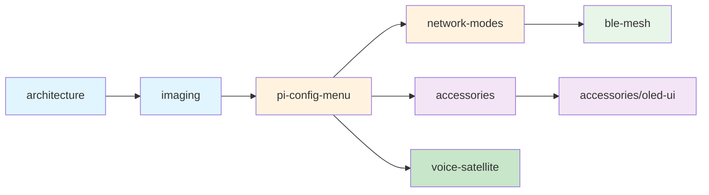

# NablaEdge Documentation

Learning-oriented documentation for the NablaEdge system. Each folder covers one topic — open it, read how it works, change it to learn.

---

## Topic Index

| Folder | What You'll Learn |
|--------|-------------------|
| [architecture/](architecture/) | Big picture: edge nodes, protocols, data flow |
| [pi-config-menu/](pi-config-menu/) | The `nabla-config` whiptail menu — how to use and extend it |
| [network-modes/](network-modes/) | Nabla Net modes: cable, ap, cable-ap, off |
| [imaging/](imaging/) | `nabla-image`: create bootable SD/USB with first-boot injection; APT migration |
| [accessories/](accessories/) | Hardware: OLED, rotary, large SPI + OLED UI paint layer |
| [esphome-patterns/](esphome-patterns/) | How to build OLED+encoder / BLE mounts (no private fleet YAML) |
| [ble-mesh/](ble-mesh/) | BLE presence/contagion mesh protocol |
| [packages-apt/](packages-apt/) | APT repository install, tarball fallback, publishing workflow |
| [voice-satellite/](voice-satellite/) | HA Assist voice satellite (LVA) — ESPHome + start_conversation |
| [manuals/](manuals/) | PDF manual shelf and classification guide |

---

## How to Use This Documentation

1. **Start with [architecture/](architecture/)** — understand the big picture
2. **Pick a topic** — each folder has a `README.md` explaining how it works
3. **Look for `HOW-IT-WORKS.md`** — optional deep-dive with diagrams
4. **Edit and experiment** — docs are designed to be modified

---

## Folder Structure

```
nablaedge/docs/
├── README.md               ← You are here (learning index)
├── architecture/           # System overview + Mermaid diagrams
├── pi-config-menu/         # nabla-config whiptail tool
├── network-modes/          # cable | ap | cable-ap | off
│   └── pdf/                # Network explainer PDFs
├── imaging/                # nabla-image, first-boot, OTP
├── accessories/            # OLED / rotary / large display flags
│   ├── oled-ui/            # Paint layer: luma vs ESP, 128×64 profile
│   └── pdf/                # Pinouts, stickers, accessory lists
├── ble-mesh/               # BLE presence protocol
├── packages-apt/           # apt repo and HTTP serving
├── voice-satellite/        # HA Assist voice satellite (LVA via ESPHome)
│   └── custom-wake-words/  # Custom microWakeWord training and deployment
└── manuals/                # PDF catalog + classification
    ├── pdf/                # General PDFs
    └── private/            # Index only (binaries on NAS)
```

---

## Related Resources

| Location | Content |
|----------|---------|
| [protocols/menu/](../../protocols/menu/) | nabla.menu/v1 specification |
| [ui/ssd/](../ui/ssd/) | OLED layout profiles and tokens |
| [packages/](../../packages/) | Apt package metadata |
| [dist/](../../dist/) | HTTP serving configuration |
| [examples/](../../examples/) | Placeholder examples |

---

## Conventions

All examples use placeholder values per [AGENTS.md](../../AGENTS.md):

| Type | Use This | Not This |
|------|----------|----------|
| Site name | `demo` | Real site names |
| IPs | `192.0.2.x` or `example.local` | 10.x, 192.168.x, 100.x |
| Secrets | `CHANGE_ME` | Real passwords/tokens |
| Entity IDs | `switch.example_light` | Real HA entities |
| Hostnames | `node1.example.local` | Real hostnames |

---

## Learning Path



1. **Blue** — Foundation: understand the system, create images
2. **Orange** — Configuration: set up nodes, configure network
3. **Purple** — Hardware: displays, input devices, OLED paint layer
4. **Green** — Advanced: mesh networking, voice assistant
