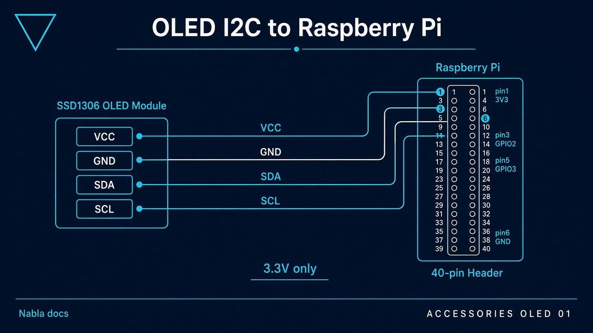
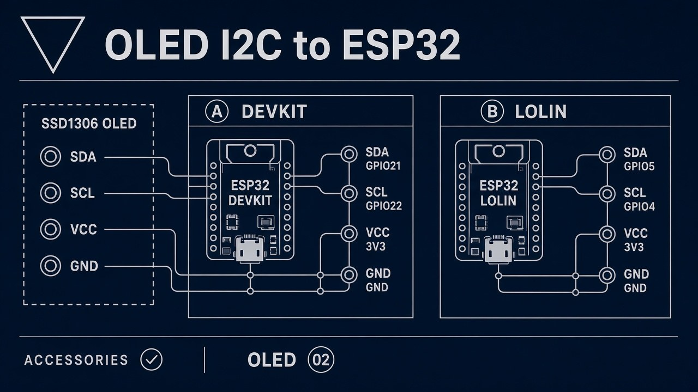

# Accessories

Hardware you can declare on an Edge node (and similar mounts on ESP32).

## Profile flags (`nabla-config` → Accessories)

Written to `/etc/nabla-net/accessories.conf`:

```bash
display_oled=0|1
rotary=0|1
display_large=0|1
```

## OLED I2C wiring





Paint/layout tokens: [`oled-ui/`](oled-ui/) → [`../../ui/ssd/`](../../ui/ssd/).

## Rotary + screen (software pattern)

How a **menu device** behaves (ESPHome-style) is documented under [`../esphome-patterns/`](../esphome-patterns/) — teaching patterns, not private fleet YAML.

## PDFs

Pin lists and case stickers: [`pdf/`](pdf/).
