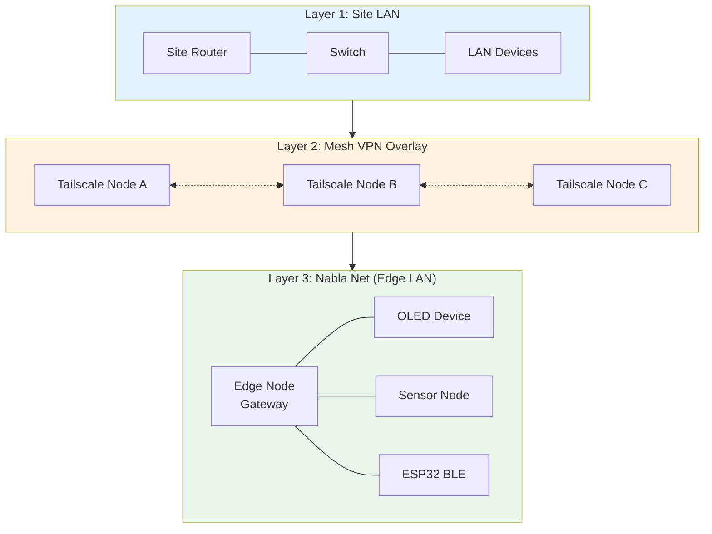
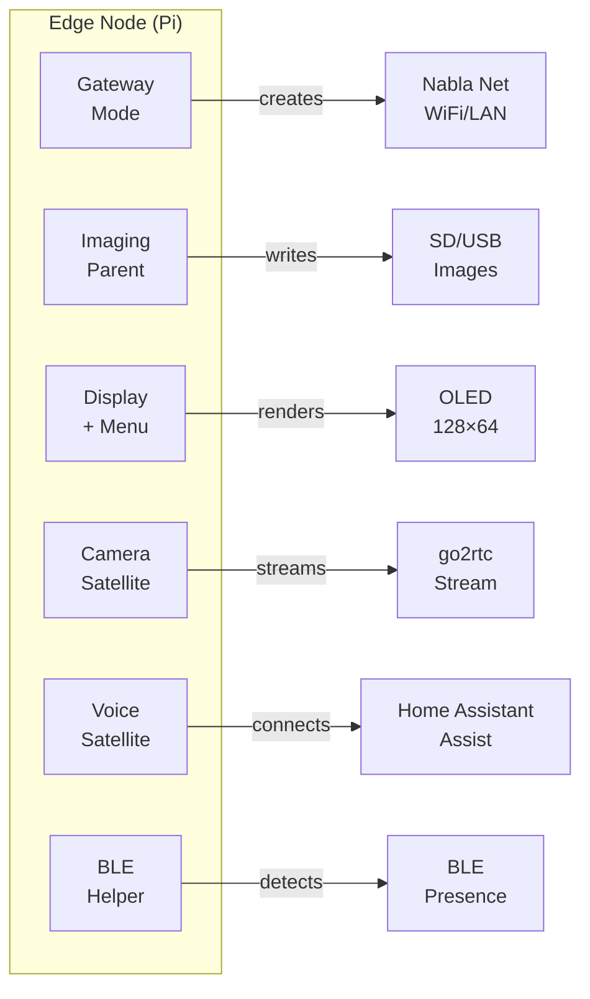
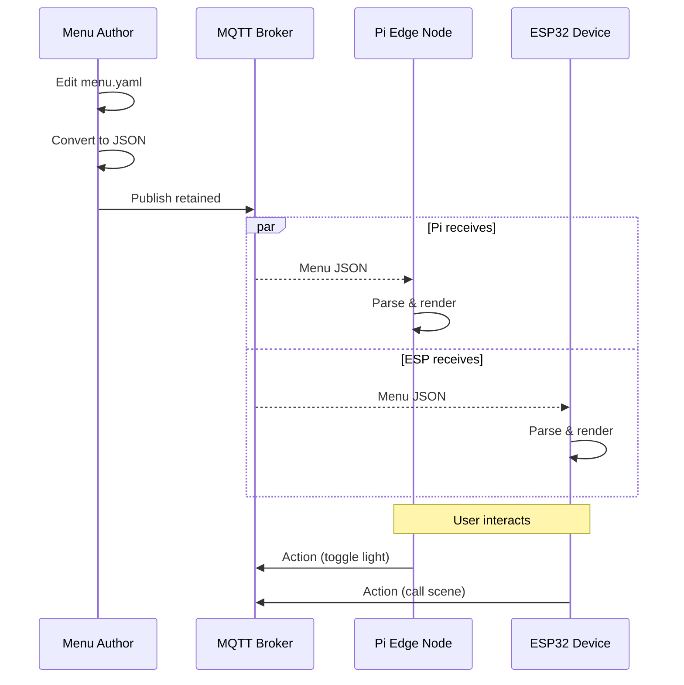
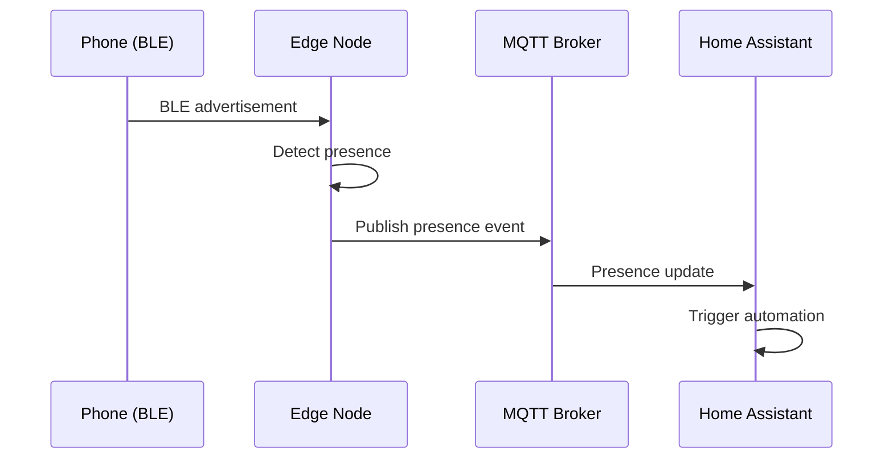
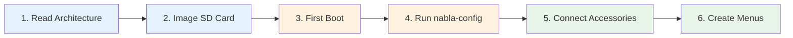

# Architecture

∇ NablaEdge system architecture: how to build your own edge network.

This document teaches the **concepts** — how layers connect, what roles nodes play, how data flows. No site-specific details; you provide those when you build.

---

## Build Your Own: What You Need

| Component | Minimum | Recommended |
|-----------|---------|-------------|
| Raspberry Pi | 1× Pi 3B+ | Pi 4 (2GB+) or Pi 5 |
| MicroSD or USB | 16GB | 32GB+ USB 3.0 |
| OLED Display | — | SSD1306 128×64 I2C |
| Rotary Encoder | — | KY-040 or EC11 |
| Network | Ethernet or WiFi | Both (for gateway mode) |
| MQTT Broker | Any | Mosquitto on Pi or separate |

**Start simple**: One Pi with OLED + encoder. Add more nodes as you learn.

---

## The Three Layers

NablaEdge operates across three conceptual network layers:



### Layer 1: Site LAN

The existing local network at a location:
- Standard home/office router
- Ethernet switches
- Existing WiFi
- Internet uplink

Edge nodes connect to this layer for upstream connectivity.

### Layer 2: Mesh VPN Overlay (Conceptual)

A virtual network connecting nodes across sites:
- Encrypted tunnels between locations
- Allows edge nodes at different sites to communicate
- Optional — single-site deployments don't need this

**Note**: Implementation details (Tailscale, WireGuard, etc.) are site-specific and not documented here.

### Layer 3: Nabla Net (Edge LAN)

The local network created by edge nodes for IoT devices:
- Created by edge node in `ap` or `cable-ap` mode
- Isolates edge devices from main LAN
- Runs MQTT broker for device communication
- Devices that can't join main WiFi connect here

---

## Edge Node Roles

A Raspberry Pi edge node can serve multiple roles:



### Gateway Mode

Creates and manages Nabla Net:
- Runs `nabla-net` service
- Provides DHCP for Nabla Net clients
- Routes traffic to upstream network
- Runs MQTT broker (optional)

### Imaging Parent

Prepares boot media for new nodes:
- Runs `nabla-image` tool
- Downloads and customizes Pi OS
- Injects first-boot scripts
- Writes to SD/USB media

### Display + Menu

Interactive OLED interface:
- 128×64 OLED (SSD1306 I2C)
- Rotary encoder for navigation
- Receives menus via MQTT
- Executes actions (HA, MQTT, internal)

### Camera Satellite

Video streaming node:
- Pi Camera Module or USB cam
- Streams via go2rtc
- Separate from voice (can combine)

### Voice Satellite

Home Assistant Assist endpoint:
- USB microphone + speaker
- Wake word detection (local)
- Speech-to-text via HA Wyoming
- Text-to-speech response

### BLE Helper

Bluetooth presence and mesh:
- Detects BLE beacons
- Reports presence to MQTT
- Participates in BLE mesh
- Can provision orphaned nodes

---

## Data Flow

### Menu System



### Presence Detection



---

## Component Map

```
nabla-edge/
├── nablaedge/
│   ├── docs/           ← You are here
│   ├── scripts/        ← CLI tools (nabla-config, nabla-net, nabla-image)
│   └── ui/ssd/         ← OLED paint layer
│
├── protocols/
│   └── menu/           ← Menu JSON protocol (backend-agnostic)
│
├── homeassistant/      ← HA integration (optional backend)
├── packages/           ← Apt package metadata
└── dist/               ← HTTP serving config
```

---

## Protocol References

| Protocol | Location | Purpose |
|----------|----------|---------|
| nabla.menu/v1 | [protocols/menu/](../../../protocols/menu/) | MQTT JSON menus |
| OLED Layout | [ui/ssd/](../../ui/ssd/) | 128×64 paint profiles |
| BLE Mesh | [ble-mesh/](../ble-mesh/) | Presence, provisioning |

---

## Build Path: From Zero to Running



1. **[Architecture](.)** — Understand the layers (you are here)
2. **[Imaging](../imaging/)** — Create bootable media with `nabla-image`
3. **First Boot** — Pi auto-configures, installs packages
4. **[nabla-config](../pi-config-menu/)** — Set network mode, enable accessories
5. **[Accessories](../accessories/)** — Wire OLED, encoder per GPIO tables
6. **[Menu Protocol](../../../protocols/menu/)** — Write YAML menus, publish via MQTT

---

## Diagrams

*Hub-and-spoke network diagrams showing generic Site A / Site B topology will be added here.*

<!-- When Dom's JPEGs land:

-->

---

## How to Modify

| Goal | What to Change |
|------|----------------|
| Add a node role | Create systemd service, add to `nabla-config` |
| New network mode | Add `apply_mode_*()` function in `nabla-net` |
| New protocol | Add folder in `protocols/` with schema |
| Custom OLED layout | Edit `ui/ssd/profiles/` YAML |

---

## Related

- [../network-modes/](../network-modes/) — How Nabla Net modes work
- [../imaging/](../imaging/) — Creating boot images
- [../esphome-patterns/](../esphome-patterns/) — ESP32 device patterns
- [../accessories/](../accessories/) — GPIO wiring and pin tables
