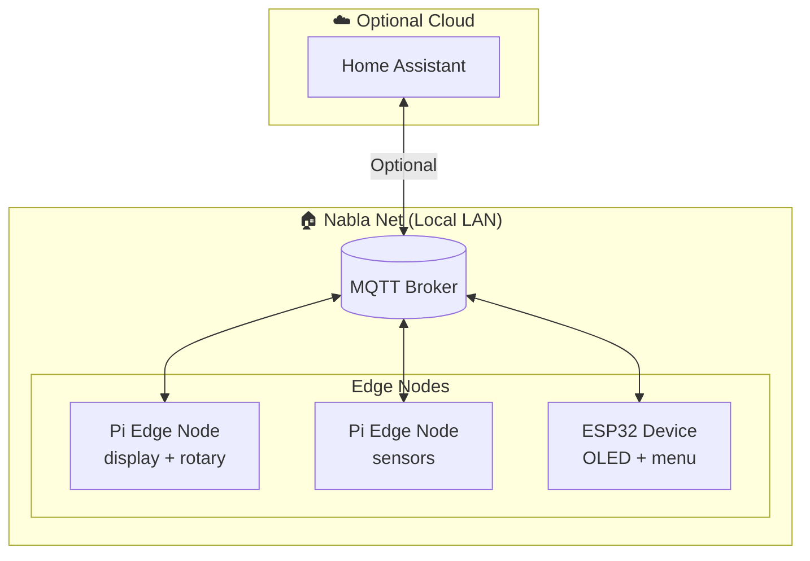
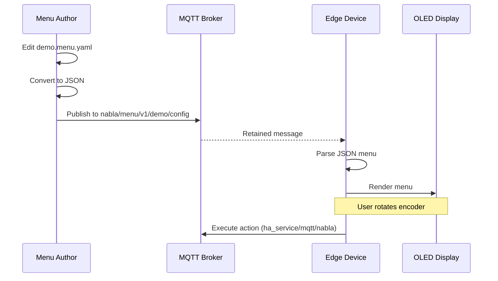
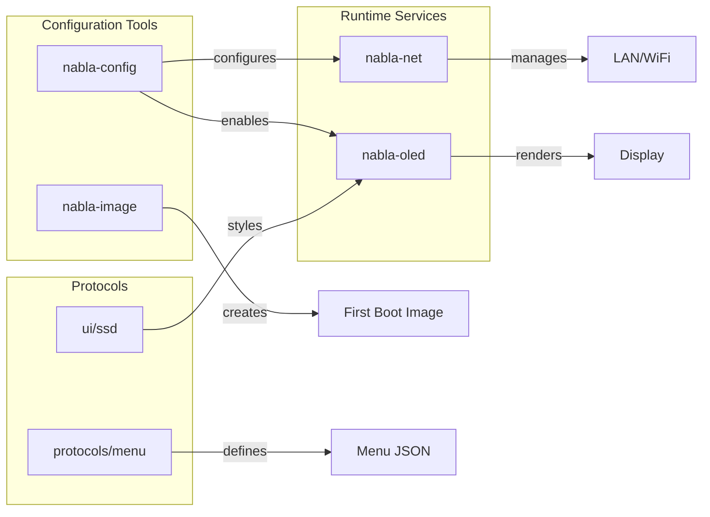

# Architecture

System overview of NablaEdge: edge nodes, protocols, and data flow.

---

## What is NablaEdge?

NablaEdge is an edge computing system for home automation and IoT, built around Raspberry Pi nodes:

1. **Edge-first** — Processing happens locally, not in the cloud
2. **MQTT-driven** — Menus, configs, and commands flow over MQTT
3. **No reflash updates** — Device behavior changes via config, not firmware
4. **Backend-agnostic** — Works with Home Assistant, but doesn't require it

---

## System Diagram



---

## Core Components

### 1. Pi Edge Nodes

Raspberry Pi devices running Debian-based OS with NablaEdge packages:

| Role | Description |
|------|-------------|
| **Display Node** | OLED screen + rotary encoder, runs menu engine |
| **Sensor Node** | Environmental sensors, reports via MQTT |
| **Gateway Node** | Bridges Nabla Net to uplink network |

Nodes can combine roles. A single Pi might run display, sensors, and gateway.

### 2. Nabla Net (LAN)

The local network connecting edge nodes:

- **Modes**: Wired-only, WiFi AP, dual-radio bridge
- **Isolation**: Nodes communicate locally even without internet
- **See**: [../network-modes/](../network-modes/)

### 3. nabla.menu Protocol

JSON-over-MQTT protocol for dynamic menus:

- Menus defined in YAML, converted to JSON
- Published as retained MQTT messages
- Devices subscribe and render locally
- **See**: [protocols/menu/PROTOCOL.md](../../../protocols/menu/PROTOCOL.md)

### 4. OLED UI Layer

Shared visual definitions for small displays:

- Layout regions, fonts, colors
- Same profile for Pi (luma.oled) and ESP (ESPHome)
- **See**: [../accessories/oled-ui/](../accessories/oled-ui/)

---

## Data Flow



---

## Directory Structure

```
nabla-edge/
├── nablaedge/              # Edge system
│   ├── docs/               # ← Documentation (you are here)
│   ├── ui/ssd/             # OLED paint layer
│   ├── esphome/            # ESPHome components (planned)
│   └── firmware/           # Device configs (gitignored)
│
├── protocols/              # Backend-agnostic specs
│   └── menu/               # nabla.menu/v1 protocol
│
├── homeassistant/          # HA integration (optional)
├── packages/               # Apt package metadata
├── dist/                   # HTTP serving config
└── examples/               # Placeholder examples
```

---

## Component Relationships



---

## First Boot vs Apt

NablaEdge supports two installation paths:

### First Boot Injection

For new Pi deployments:

1. Download Raspberry Pi OS
2. Run `nabla-image` to inject first-boot scripts
3. Write to SD/USB
4. Boot Pi — it auto-configures

**See**: [../imaging/](../imaging/)

### Apt Installation (Planned)

For existing systems:

```bash
# Add repository (example URL)
echo "deb [trusted=yes] https://apt.example.local/nabla stable main" \
    | sudo tee /etc/apt/sources.list.d/nabla.list

sudo apt update
sudo apt install nabla-edge
```

**Note**: Apt installation is planned. Currently, first-boot is the primary method.

---

## Why This Architecture?

### Edge Processing
- **Latency**: Local control responds in milliseconds
- **Reliability**: Works during internet outages
- **Privacy**: Data stays on-premises

### MQTT as Backbone
- **Simple**: Pub/sub model is easy to understand
- **Decoupled**: Publishers and subscribers don't know each other
- **Retained**: New devices receive current state immediately

### No-Reflash Updates
- **Safe**: Menu changes can't brick devices
- **Fast**: JSON update vs. firmware compile/flash
- **Flexible**: Different menus for different users/times

### Backend Agnostic
- **Home Assistant**: Use `ha_service` actions
- **Raw MQTT**: Use `mqtt` actions for any subscriber
- **Internal**: Use `nabla` actions for device commands

---

## How to Change This

To modify the architecture documentation:

1. Edit this `README.md` for text changes
2. Update Mermaid diagrams inline (rendered by GitHub/viewers)
3. Add `HOW-IT-WORKS.md` for deeper technical detail
4. Keep placeholder values per [AGENTS.md](../../../AGENTS.md)
