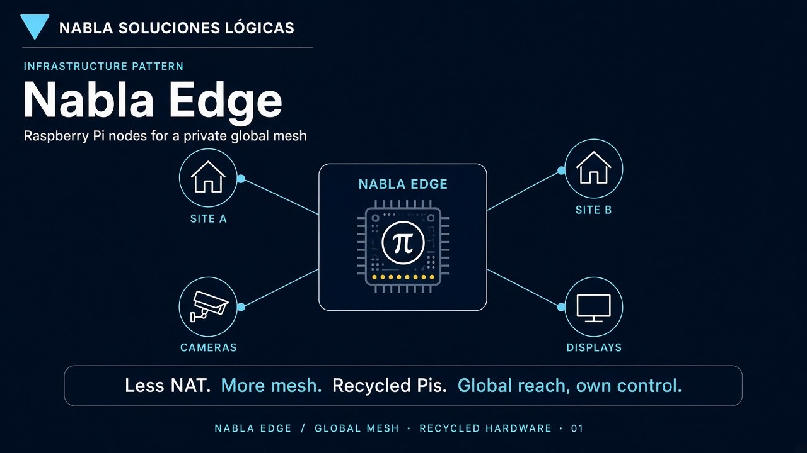
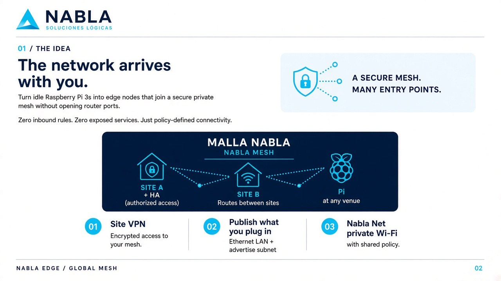
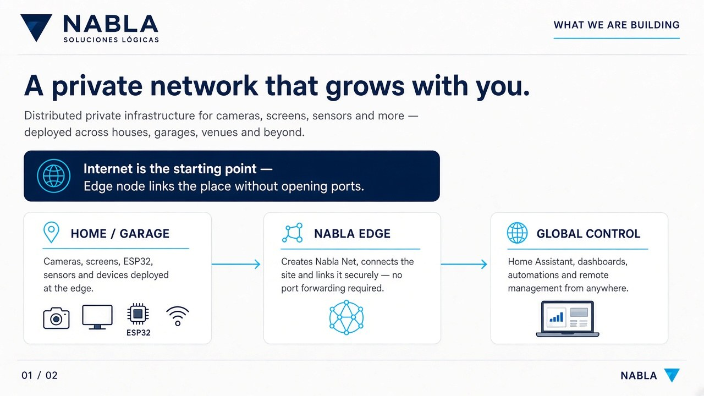

# Architecture

Pedagogical goal: after reading this folder, someone who has never seen your sites can still **build** a Nabla Edge deployment for themselves.

## The three layers

See [diagrams/three-layers.jpg](diagrams/three-layers.jpg).

1. **Site LAN** — normal Wi-Fi/router in one place.
2. **Private mesh** — encrypted overlay for authorized machines across sites (no public ports).
3. **Nabla Edge** — Pi/Linux gateway that creates a **Nabla Net** (cable and/or AP) for devices that do not run a mesh client (TVs, cameras, ESP32s, etc.).

## Hub picture

One Edge node brings cameras, displays, and local gear into the private mesh.

## Mesh idea

1. Site VPN / mesh access  
2. Publish subnets of what you plug into Ethernet  
3. Optional Nabla Net Wi-Fi with shared policy  

## End-to-end flow

## Related

- Network mode details → [`../network-modes/`](../network-modes/)
- Imaging / first-boot → [`../imaging/`](../imaging/)
- Menu protocol (MQTT) → [`../../../protocols/menu/`](../../../protocols/menu/)
- OLED paint → [`../../ui/ssd/`](../../ui/ssd/)

Private pitch PDFs that still name real venues stay on the private docs share (`manuals/private/`).
