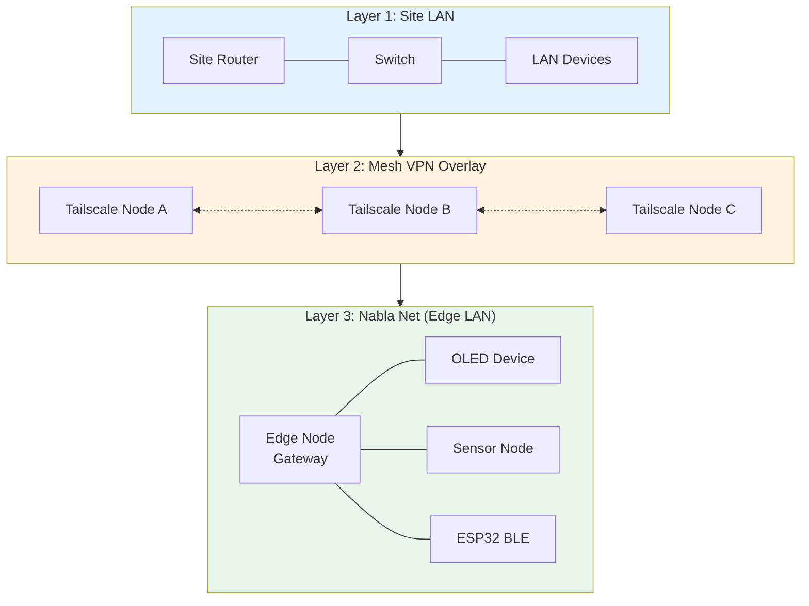
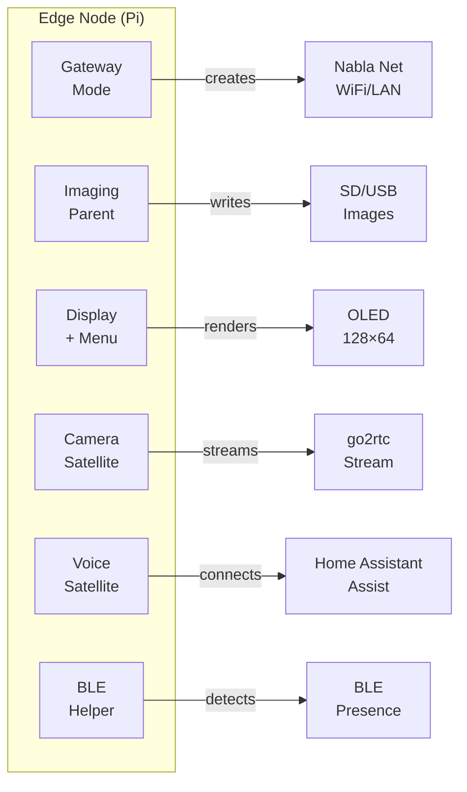
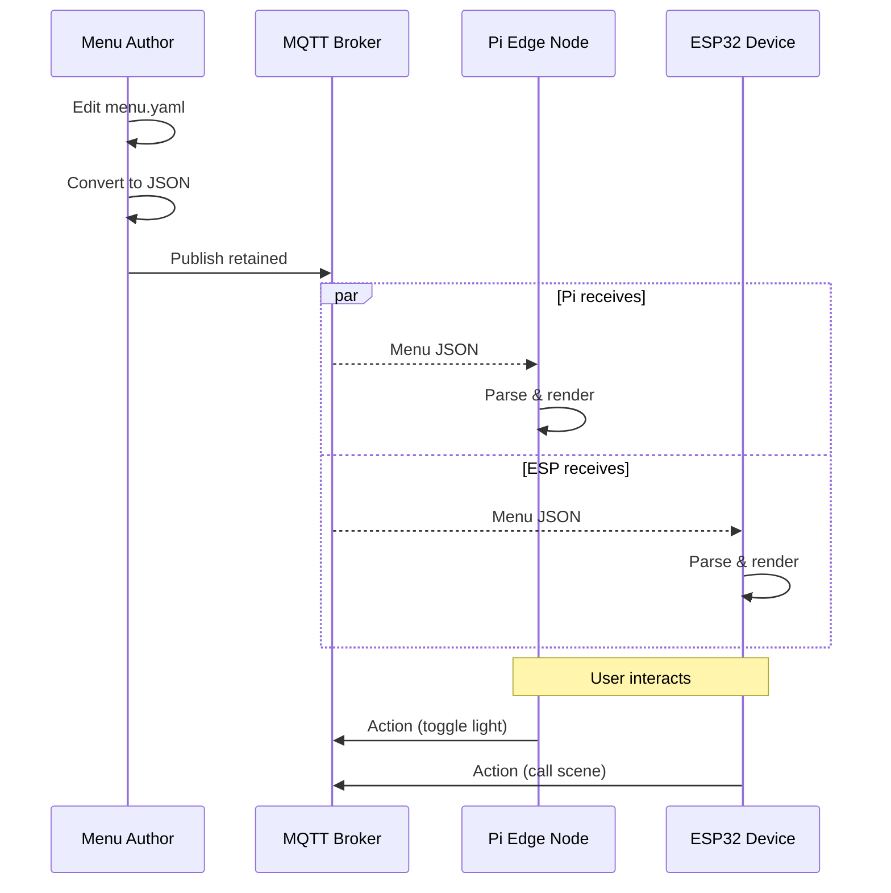
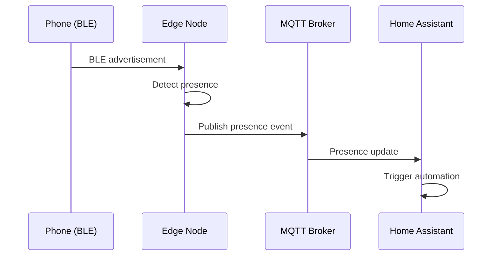

# Architecture

NablaEdge system architecture: three network layers, edge node roles, and component relationships.

---

## The Three Layers

NablaEdge operates across three conceptual network layers:



### Layer 1: Site LAN

The existing local network at a location:
- Standard home/office router
- Ethernet switches
- Existing WiFi
- Internet uplink

Edge nodes connect to this layer for upstream connectivity.

### Layer 2: Mesh VPN Overlay (Conceptual)

A virtual network connecting nodes across sites:
- Encrypted tunnels between locations
- Allows edge nodes at different sites to communicate
- Optional — single-site deployments don't need this

**Note**: Implementation details (Tailscale, WireGuard, etc.) are site-specific and not documented here.

### Layer 3: Nabla Net (Edge LAN)

The local network created by edge nodes for IoT devices:
- Created by edge node in `ap` or `cable-ap` mode
- Isolates edge devices from main LAN
- Runs MQTT broker for device communication
- Devices that can't join main WiFi connect here

---

## Edge Node Roles

A Raspberry Pi edge node can serve multiple roles:



### Gateway Mode

Creates and manages Nabla Net:
- Runs `nabla-net` service
- Provides DHCP for Nabla Net clients
- Routes traffic to upstream network
- Runs MQTT broker (optional)

### Imaging Parent

Prepares boot media for new nodes:
- Runs `nabla-image` tool
- Downloads and customizes Pi OS
- Injects first-boot scripts
- Writes to SD/USB media

### Display + Menu

Interactive OLED interface:
- 128×64 OLED (SSD1306 I2C)
- Rotary encoder for navigation
- Receives menus via MQTT
- Executes actions (HA, MQTT, internal)

### Camera Satellite

Video streaming node:
- Pi Camera Module or USB cam
- Streams via go2rtc
- Separate from voice (can combine)

### Voice Satellite

Home Assistant Assist endpoint:
- USB microphone + speaker
- Wake word detection (local)
- Speech-to-text via HA Wyoming
- Text-to-speech response

### BLE Helper

Bluetooth presence and mesh:
- Detects BLE beacons
- Reports presence to MQTT
- Participates in BLE mesh
- Can provision orphaned nodes

---

## Data Flow

### Menu System



### Presence Detection



---

## Component Map

```
nabla-edge/
├── nablaedge/
│   ├── docs/           ← You are here
│   ├── scripts/        ← CLI tools (nabla-config, nabla-net, nabla-image)
│   └── ui/ssd/         ← OLED paint layer
│
├── protocols/
│   └── menu/           ← Menu JSON protocol (backend-agnostic)
│
├── homeassistant/      ← HA integration (optional backend)
├── packages/           ← Apt package metadata
└── dist/               ← HTTP serving config
```

---

## Protocol References

| Protocol | Location | Purpose |
|----------|----------|---------|
| nabla.menu/v1 | [protocols/menu/](../../../protocols/menu/) | MQTT JSON menus |
| OLED Layout | [ui/ssd/](../../ui/ssd/) | 128×64 paint profiles |
| BLE Mesh | [ble-mesh/](../ble-mesh/) | Presence, provisioning |

---

## How to Change This

1. **Add a role**: Create service, add to `nabla-config` menu
2. **Change network**: Modify `nabla-net` modes
3. **New protocol**: Add to `protocols/` with schema
4. **Update docs**: Edit this file, keep diagrams current

---

## Related

- [../network-modes/](../network-modes/) — How Nabla Net modes work
- [../imaging/](../imaging/) — Creating boot images
- [../esphome-patterns/](../esphome-patterns/) — ESP32 device patterns
