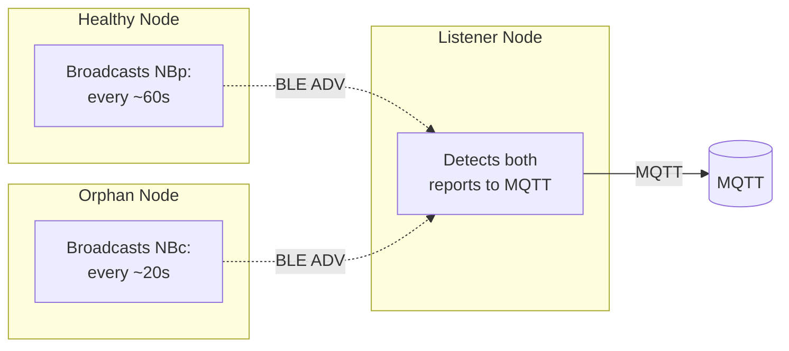
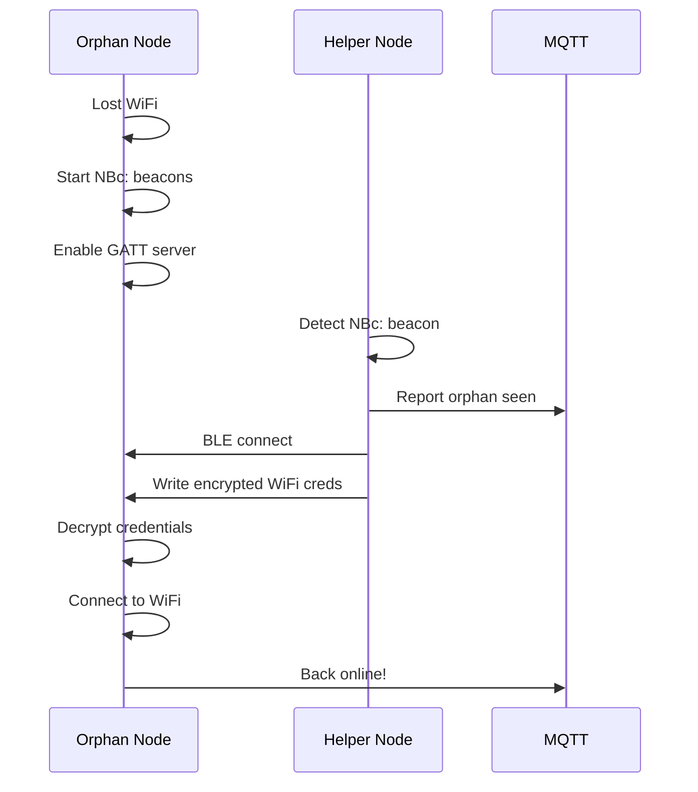

# BLE Mesh — Presence and Provisioning

BLE-based presence detection and orphan node recovery for NablaEdge.

---

## Overview

NablaEdge uses BLE (Bluetooth Low Energy) for:

1. **Presence detection** — Know which devices are nearby
2. **Orphan recovery** — Help nodes that lost WiFi
3. **State propagation** — Spread information across mesh

All without requiring WiFi connectivity.

---

## Protocol Phases

### Phase 1: Advertisement Beacons

Nodes broadcast BLE advertisements to announce state:



### Phase 2: GATT Provisioning (Orphan Recovery)

Helper nodes can push WiFi credentials to orphans:



---

## Advertisement Formats

### NBp: Presence Beacon

Broadcast by healthy nodes every ~60 seconds:

```
Manufacturer Data (0xFFFF):
┌─────────────────────────────────────┐
│ Prefix    │ "NBp:" (4 bytes)        │  ← Nabla presence
│ Node ID   │ 4 bytes                 │  ← Unique identifier
│ Sequence  │ 2 bytes                 │  ← Replay protection
│ Flags     │ 1 byte                  │
│           │   bit 0: has_wifi       │
│           │   bit 1: has_mqtt       │
│           │   bit 2: is_gateway     │
│ Auth      │ 4 bytes                 │  ← HMAC tag
└─────────────────────────────────────┘
```

### NBc: Need-WiFi Beacon ("Contagion")

Broadcast by orphaned nodes every ~20 seconds:

```
Manufacturer Data (0xFFFF):
┌─────────────────────────────────────┐
│ Prefix    │ "NBc:" (4 bytes)        │  ← Nabla contagion/cry
│ Node ID   │ 4 bytes                 │
│ Sequence  │ 2 bytes                 │
│ Flags     │ 1 byte                  │
│           │   bit 0: needs_wifi     │
│           │   bit 1: needs_mqtt     │
│ Auth      │ 4 bytes                 │
└─────────────────────────────────────┘
```

---

## Security

### Shared Secret

All nodes in a mesh share a provisioning secret:

```ini
# /etc/nabla-net/ble.conf
ble_mesh_secret=CHANGE_ME
```

**Replace `CHANGE_ME`** with a strong random string (32+ characters).

### Authentication

Each advertisement includes a truncated HMAC:

```
auth_tag = HMAC-SHA256(secret, packet_without_auth)[0:4]
```

Nodes reject packets with invalid tags.

### Replay Protection

- Each node maintains a monotonic sequence counter
- Listeners track last-seen sequence per sender
- Reject packets with old/duplicate sequences

### Credential Encryption

WiFi credentials sent via GATT are encrypted:

```
Key:        SHA256(provision_secret)[0:16]  (first 16 bytes)
IV:         Random 16 bytes (prepended to ciphertext)
Cipher:     AES-128-CTR
Plaintext:  SSID + '\0' + PASSWORD
Transmitted: IV || AES-CTR(plaintext, key, IV)
```

---

## MQTT Topics

Presence events published by listener nodes:

```
# Presence detected
Topic: nabla/ble/presence/{node_id}
Payload: {
  "rssi": -65,
  "flags": 3,
  "seen_by": "listener01",
  "timestamp": "2024-01-15T10:30:00Z"
}

# Orphan detected
Topic: nabla/ble/orphan/{node_id}
Payload: {
  "rssi": -72,
  "needs_wifi": true,
  "seen_by": "listener01"
}
```

---

## Configuration

### Enabling BLE Mesh

```bash
sudo nabla-config --network
# → BLE mesh → Enable
```

Or manually edit `/etc/nabla-net/ble.conf`:

```ini
# BLE Mesh Configuration

# Master enable
ble_mesh_enabled=1

# Shared secret (CHANGE THIS!)
ble_mesh_secret=CHANGE_ME

# Presence detection
presence_enabled=1
presence_interval_ms=60000
presence_rssi_threshold=-80

# Orphan mode (when WiFi lost)
orphan_beacon_interval_ms=20000
orphan_gatt_enabled=1

# Helper mode (provision orphans)
helper_enabled=1
```

---

## RSSI Thresholds

| RSSI | Signal | Typical Distance |
|------|--------|------------------|
| -50 | Excellent | < 1m (same room, close) |
| -60 | Good | 1-3m (same room) |
| -70 | Fair | 3-5m (nearby) |
| -80 | Weak | 5-10m (adjacent room) |
| -90 | Very weak | 10m+ (through walls) |

Configure threshold based on use case:
- `-60` for room-level presence
- `-80` for building-wide detection

---

## Implementation Notes

### ESP32 (ESPHome)

See [../esphome-patterns/](../esphome-patterns/) for ESPHome YAML patterns.

### Raspberry Pi

Pi-based nodes can use BlueZ for BLE:

```bash
# Scan for advertisements
sudo hcitool lescan

# Advertise (requires bluetoothctl or custom code)
```

Full Pi BLE implementation TBD.

---

## Limitations

- **Range**: BLE typically 10-30m, varies with environment
- **Latency**: 60s beacon interval means delayed detection
- **Battery**: Constant scanning uses power (less issue for mains-powered)
- **Interference**: 2.4GHz congestion affects reliability

---

## How to Change This

1. **Beacon format**: Update prefix/fields in firmware
2. **Security**: Change HMAC algorithm or key derivation
3. **Intervals**: Adjust `*_interval_ms` in config
4. **GATT service**: Modify provisioning UUIDs and protocol

---

## Related

- [../esphome-patterns/](../esphome-patterns/) — ESP32 BLE patterns
- [../accessories/](../accessories/) — Hardware setup
- [../network-modes/](../network-modes/) — WiFi that orphans lost
