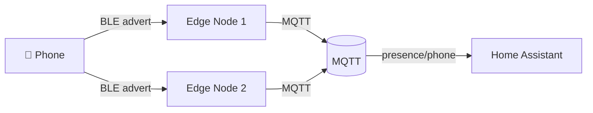

# BLE Mesh — Presence and Contagion

Protocol-level documentation for BLE-based presence detection and mesh networking.

---

## Overview

NablaEdge uses BLE (Bluetooth Low Energy) for:

- **Presence detection** — Track which devices are nearby
- **Contagion/propagation** — Spread state changes across mesh
- **Low-power operation** — Battery-friendly for mobile nodes

---

## Concepts

### Presence Detection

Nodes broadcast BLE advertisements. Other nodes listen and report:



Use cases:
- Room presence (which room is a person in?)
- Device tracking (where is the tablet?)
- Arrival/departure detection

### Contagion Model

State "spreads" between nearby nodes:

1. Node A detects presence
2. Node A broadcasts state via BLE
3. Nearby Node B receives, updates its state
4. Node B re-broadcasts to its neighbors

This creates mesh-like propagation without explicit routing.

---

## BLE Advertisement Format

### Presence Beacon

```
┌─────────────────────────────────────────┐
│ Manufacturer ID: 0xFFFF (placeholder)   │
│ Type: 0x01 (presence)                   │
│ Node ID: [4 bytes]                      │
│ Sequence: [2 bytes]                     │
│ RSSI threshold: [1 byte]                │
│ Auth tag: [4 bytes] (HMAC truncated)    │
└─────────────────────────────────────────┘
```

### State Broadcast

```
┌─────────────────────────────────────────┐
│ Manufacturer ID: 0xFFFF (placeholder)   │
│ Type: 0x02 (state)                      │
│ State key: [2 bytes]                    │
│ State value: [4 bytes]                  │
│ TTL: [1 byte]                           │
│ Auth tag: [4 bytes]                     │
└─────────────────────────────────────────┘
```

---

## Security

### Shared Secret

All nodes in a mesh share a secret for authentication:

```ini
# /etc/nabla-net/ble.conf
ble_mesh_secret=CHANGE_ME
```

**Important**: Replace `CHANGE_ME` with a strong random secret. This prevents unauthorized nodes from injecting presence data.

### Authentication

Each BLE packet includes a truncated HMAC:

```
auth_tag = HMAC-SHA256(secret, packet_data)[0:4]
```

Nodes reject packets with invalid auth tags.

### Replay Protection

Sequence numbers prevent replay attacks:
- Each node maintains a monotonic counter
- Receivers track last seen sequence per sender
- Reject packets with old/duplicate sequences

---

## MQTT Integration

Presence events are published to MQTT:

```
Topic: nabla/ble/presence/{node_id}
Payload: {
  "device": "phone_abc123",
  "rssi": -65,
  "timestamp": "2024-01-15T10:30:00Z"
}
```

State propagation:

```
Topic: nabla/ble/state/{state_key}
Payload: {
  "value": 1,
  "source": "node_01",
  "hops": 2,
  "timestamp": "2024-01-15T10:30:00Z"
}
```

---

## Configuration

### Enabling BLE Mesh

```bash
sudo nabla-config
# Select network options → BLE mesh → Enable
```

Or manually in `/etc/nabla-net/ble.conf`:

```ini
# BLE Mesh Configuration
ble_mesh_enabled=1
ble_mesh_secret=CHANGE_ME

# Presence detection
presence_enabled=1
presence_rssi_threshold=-70
presence_timeout_seconds=60

# State propagation
state_propagation_enabled=1
state_ttl_default=3
```

### Device Allowlist

Only track specific devices:

```ini
# /etc/nabla-net/ble-devices.conf
# Format: MAC_ADDRESS,friendly_name
AA:BB:CC:DD:EE:FF,phone_example
11:22:33:44:55:66,tablet_example
```

---

## ESPHome Integration

For ESP32 nodes with BLE:

```yaml
# Example ESPHome config (sanitized)
esp32_ble_tracker:
  scan_parameters:
    interval: 1100ms
    window: 1100ms

ble_presence:
  - platform: nabla_ble_mesh
    secret: !secret ble_mesh_secret
    on_presence:
      - mqtt.publish:
          topic: nabla/ble/presence/${device_name}
          payload: !lambda 'return x.to_json();'
```

The `nabla_ble_mesh` component will be published as an ESPHome external component.

---

## Tuning

### RSSI Thresholds

| Value | Meaning | Use Case |
|-------|---------|----------|
| -50 | Very close | Same room, near device |
| -70 | Nearby | Same room, anywhere |
| -90 | Weak | Adjacent rooms |

### TTL (Time To Live)

Controls how far state propagates:

| TTL | Hops | Use Case |
|-----|------|----------|
| 1 | Direct only | Local state |
| 3 | 3 hops | Building-wide |
| 5 | 5 hops | Large mesh |

Higher TTL = more propagation but more traffic.

---

## Limitations

- **Range**: BLE range ~10-30m depending on environment
- **Latency**: Propagation adds delay per hop
- **Battery**: Constant scanning uses power
- **Interference**: 2.4GHz congestion affects reliability

---

## Future: Public Package

The `nabla_ble_mesh` ESPHome component will be published with:

- Protocol implementation
- Example configurations (sanitized)
- Integration with nabla.menu

All secrets and site-specific data will use `CHANGE_ME` placeholders.

---

## How to Change This

1. Protocol changes require firmware updates
2. Configuration changes via `ble.conf`
3. Test security changes carefully
4. Never commit real secrets — use `CHANGE_ME`

---

## Related

- [../network-modes/](../network-modes/) — Network configuration
- [../accessories/](../accessories/) — Hardware setup
- [../../protocols/menu/](../../protocols/menu/) — Menu integration
