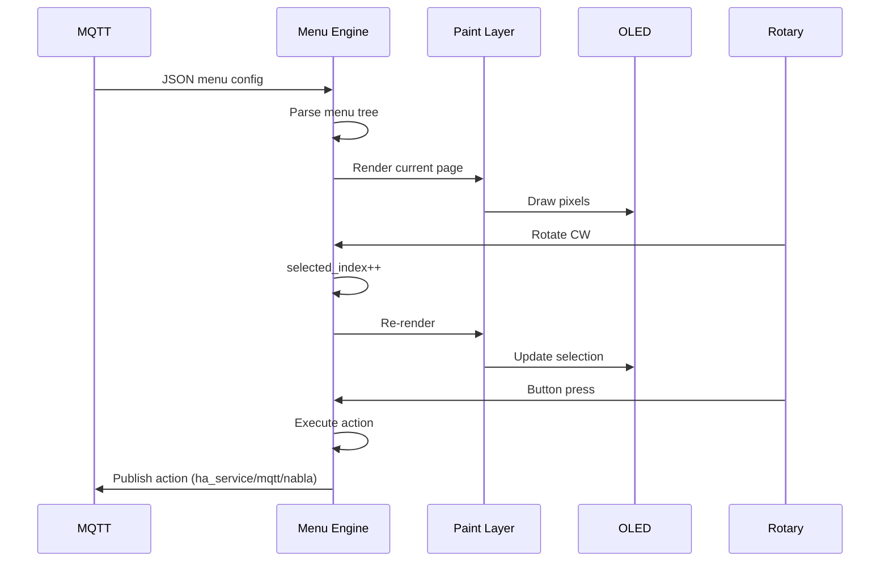
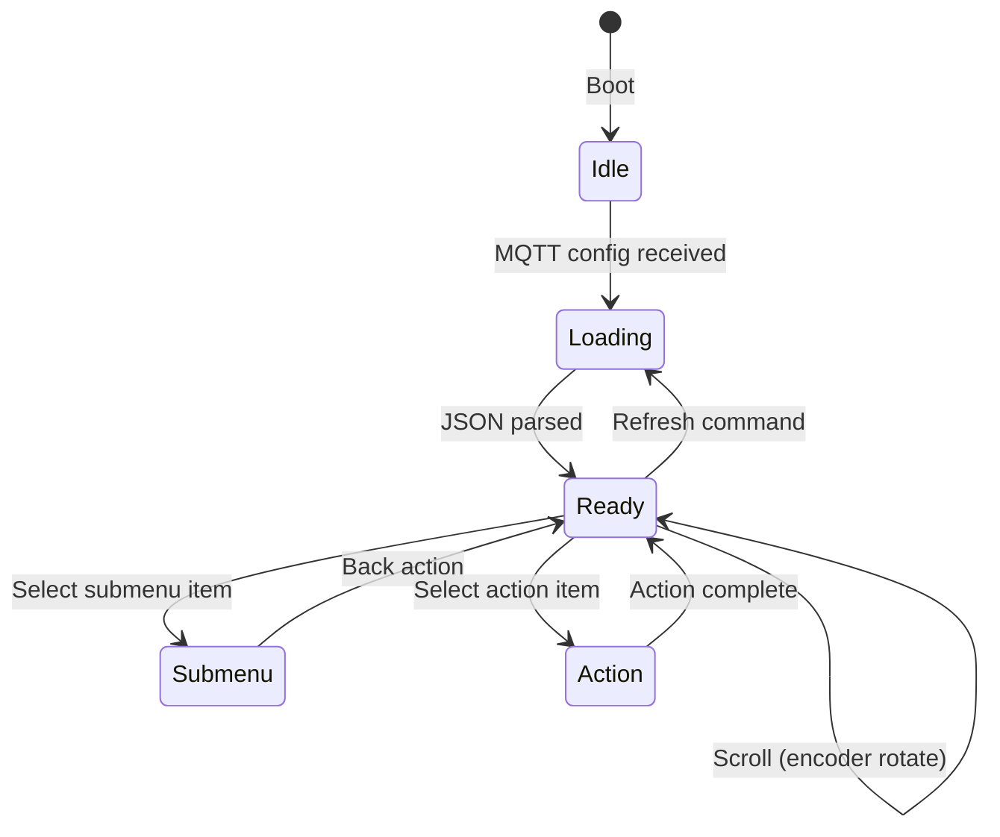
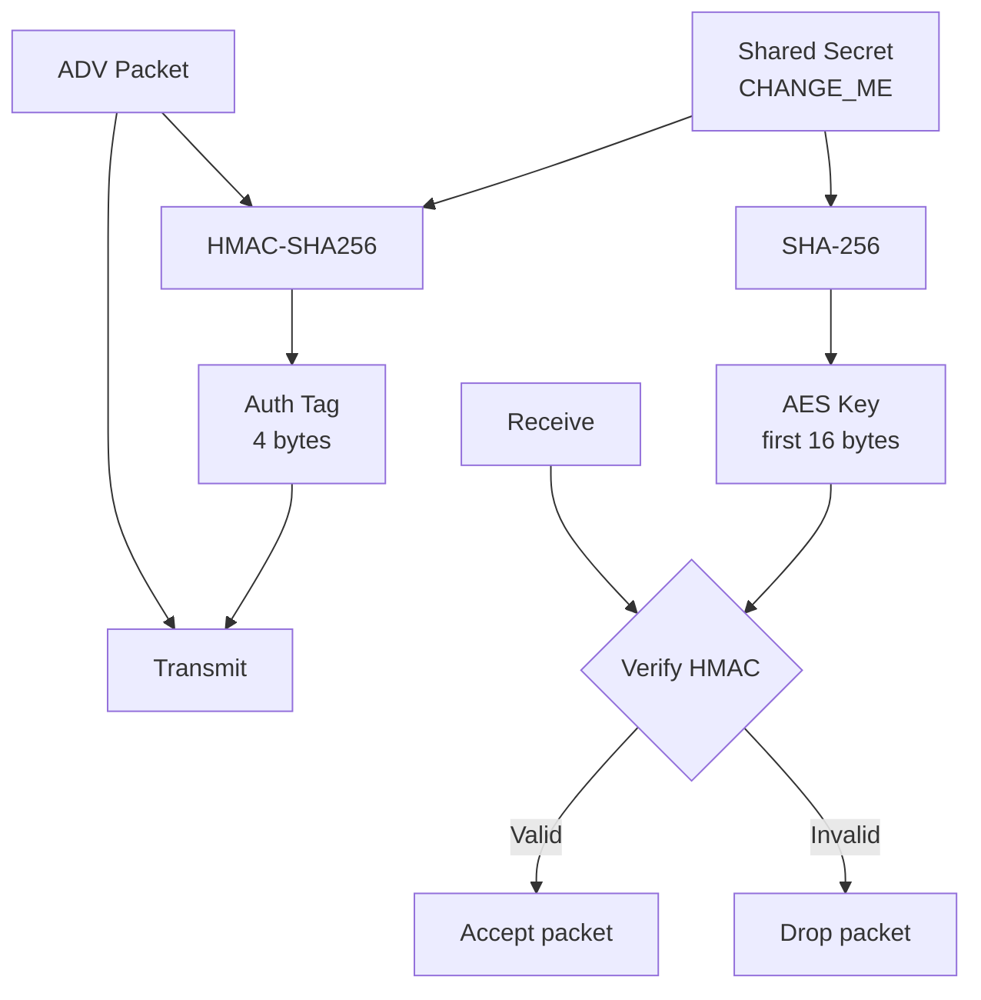
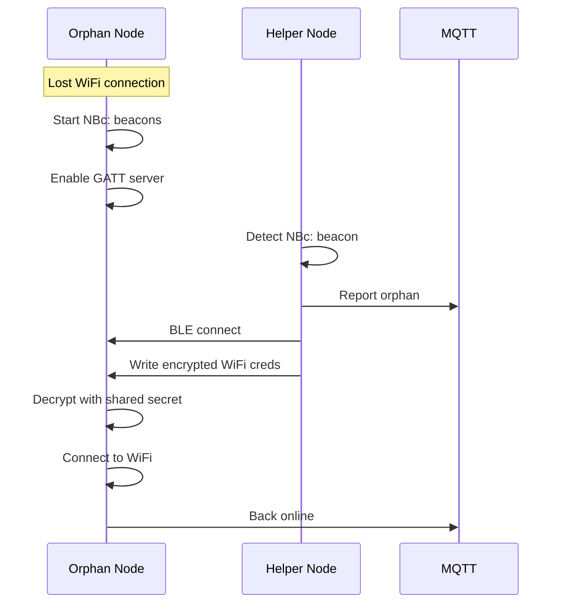

# ESPHome Patterns

Architecture patterns for NablaEdge ESPHome devices: OLED+encoder menu system and BLE mesh protocols.

These are **design patterns** with sanitized example snippets — not production fleet YAML.

---

## Contents

1. [OLED + Rotary Encoder Menu](#oled--rotary-encoder-menu)
2. [BLE Mesh Presence](#ble-mesh-presence)
3. [BLE WiFi Provisioning](#ble-wifi-provisioning)

---

## OLED + Rotary Encoder Menu

### Architecture Overview

The menu system separates **content** (what to show) from **rendering** (how to draw):

```
┌─────────────────────────────────────────────────────────────┐
│  MQTT                                                        │
│  nabla/menu/v1/{site}/config  ─────────────────────────────┐│
└─────────────────────────────────────────────────────────────┘│
                                                               │
┌─────────────────────────────────────────────────────────────┐│
│  ESP32 Device                                                ││
│  ┌─────────────┐    ┌─────────────┐    ┌─────────────┐     ││
│  │ Menu Engine │◄───│ JSON Parser │◄───│ MQTT Client │◄────┘│
│  │ (nabla_menu)│    └─────────────┘    └─────────────┘      │
│  └──────┬──────┘                                             │
│         │ current_page, items[], selected_index              │
│         ▼                                                    │
│  ┌─────────────┐    ┌─────────────┐                         │
│  │ Paint Layer │───►│ SSD1309     │───► OLED Display        │
│  │ (ui/ssd)    │    │ Driver      │    128×64 pixels        │
│  └─────────────┘    └─────────────┘                         │
│         ▲                                                    │
│         │ scroll, select, back                               │
│  ┌─────────────┐                                            │
│  │ Rotary      │◄─── Physical encoder (CLK/DT/SW)           │
│  │ Encoder     │                                            │
│  └─────────────┘                                            │
└─────────────────────────────────────────────────────────────┘
```

### Component Interaction



### ESPHome YAML Pattern

```yaml
# SANITIZED EXAMPLE — replace placeholders before use

esphome:
  name: oled-menu-demo
  platform: ESP32
  board: esp32dev

# External components (when published)
external_components:
  - source: github://txemavs/nabla-edge
    components: [nabla_menu]

# WiFi (credentials from secrets.yaml)
wifi:
  ssid: !secret wifi_ssid
  password: !secret wifi_password

# MQTT connection
mqtt:
  broker: mqtt.example.local
  username: !secret mqtt_user
  password: !secret mqtt_password
  on_json_message:
    topic: nabla/menu/v1/demo/config
    then:
      - nabla_menu.load_json:
          id: menu_engine
          json: !lambda 'return x;'

# SPI Display (SSD1309 128×64)
spi:
  clk_pin: GPIO18
  mosi_pin: GPIO23

display:
  - platform: ssd1309_spi
    id: oled
    cs_pin: GPIO5
    dc_pin: GPIO16
    reset_pin: GPIO17
    rotation: 0
    lambda: |-
      // Menu engine provides what to draw
      auto page = id(menu_engine).current_page();
      
      // Status bar (y=0, h=10)
      it.printf(2, 1, id(font_small), "∇");  // Nabla mark
      it.printf(100, 1, id(font_small), "%02d:%02d", 
                id(time_now).hour, id(time_now).minute);
      
      // Title (y=10, h=22)
      it.printf(64, 20, id(font_large), TextAlign::CENTER, 
                page.title.c_str());
      
      // Menu items (y=44, h=20, 2 visible rows)
      int start_idx = max(0, page.selected - 1);
      for (int i = 0; i < 2 && start_idx + i < page.items.size(); i++) {
        int idx = start_idx + i;
        bool selected = (idx == page.selected);
        const char* caret = selected ? "▶" : " ";
        it.printf(2, 44 + i*10, id(font_small), "%s %s", 
                  caret, page.items[idx].label.c_str());
      }

# Rotary Encoder
sensor:
  - platform: rotary_encoder
    id: encoder
    pin_a: GPIO32
    pin_b: GPIO33
    resolution: 1
    on_clockwise:
      - nabla_menu.scroll:
          id: menu_engine
          direction: down
    on_anticlockwise:
      - nabla_menu.scroll:
          id: menu_engine
          direction: up

binary_sensor:
  - platform: gpio
    id: encoder_button
    pin:
      number: GPIO25
      mode: INPUT_PULLUP
      inverted: true
    on_press:
      - nabla_menu.select:
          id: menu_engine

# Menu Engine (custom component)
nabla_menu:
  id: menu_engine
  site: demo
  on_action:
    - lambda: |-
        // Action execution callback
        if (action.kind == "mqtt") {
          // Publish to MQTT topic
        } else if (action.kind == "nabla") {
          if (action.command == "reboot") {
            ESP.restart();
          }
        }

# Fonts
font:
  - file: "gfonts://Roboto"
    id: font_small
    size: 8
  - file: "gfonts://Roboto"
    id: font_large
    size: 16

# Time (for status bar clock)
time:
  - platform: sntp
    id: time_now
```

### Menu Engine State Machine



### GPIO Wiring Reference

| Function | ESP32 Pin | Notes |
|----------|-----------|-------|
| OLED SPI CLK | GPIO18 | SPI clock |
| OLED SPI MOSI | GPIO23 | SPI data |
| OLED CS | GPIO5 | Chip select |
| OLED DC | GPIO16 | Data/command |
| OLED RST | GPIO17 | Reset |
| Encoder CLK | GPIO32 | Rotary A |
| Encoder DT | GPIO33 | Rotary B |
| Encoder SW | GPIO25 | Button (pullup) |

See [../accessories/diagrams/](../accessories/diagrams/) for wiring photos.

---

## BLE Mesh Presence

### Protocol Overview

BLE mesh enables presence detection and state propagation without WiFi infrastructure.

```
┌─────────────┐         BLE ADV         ┌─────────────┐
│ Node A      │ ─────────────────────►  │ Node B      │
│ (presence)  │                         │ (listener)  │
└─────────────┘                         └──────┬──────┘
                                               │
                                               ▼ MQTT
                                        ┌─────────────┐
                                        │ Broker      │
                                        └─────────────┘
```

### Advertisement Frames

#### Presence Beacon (NBp:)

Broadcast every ~60 seconds to announce presence:

```
Manufacturer Data (0xFFFF):
┌────────────────────────────────────────────┐
│ Prefix: "NBp:" (4 bytes)                   │
│ Node ID: 4 bytes (unique identifier)       │
│ Sequence: 2 bytes (replay protection)      │
│ Flags: 1 byte                              │
│   bit 0: has_wifi                          │
│   bit 1: has_mqtt                          │
│   bit 2: is_gateway                        │
│ Auth: 4 bytes (HMAC-SHA256 truncated)      │
└────────────────────────────────────────────┘
```

#### Need WiFi Beacon (NBc:)

Broadcast every ~20 seconds when orphaned (no WiFi):

```
Manufacturer Data (0xFFFF):
┌────────────────────────────────────────────┐
│ Prefix: "NBc:" (4 bytes) — "contagion"     │
│ Node ID: 4 bytes                           │
│ Sequence: 2 bytes                          │
│ Flags: 1 byte                              │
│   bit 0: needs_wifi                        │
│   bit 1: needs_mqtt                        │
│ Auth: 4 bytes                              │
└────────────────────────────────────────────┘
```

### ESPHome BLE Scanner Pattern

```yaml
# SANITIZED EXAMPLE — BLE presence detection

esp32_ble_tracker:
  scan_parameters:
    interval: 1100ms
    window: 1100ms
    active: false

# Custom BLE device detection
binary_sensor:
  - platform: ble_presence
    name: "Phone Nearby"
    mac_address: AA:BB:CC:DD:EE:FF  # CHANGE_ME
    timeout: 5min

# Nabla mesh listener (custom component pattern)
# Detects NBp: and NBc: prefixed advertisements
nabla_ble_mesh:
  id: mesh
  secret: !secret ble_mesh_secret  # CHANGE_ME in secrets.yaml
  on_presence:
    - lambda: |-
        ESP_LOGI("mesh", "Node %s present, RSSI %d", 
                 x.node_id.c_str(), x.rssi);
    - mqtt.publish:
        topic: !lambda 'return "nabla/ble/presence/" + x.node_id;'
        payload: !lambda |-
          return "{\"rssi\":" + to_string(x.rssi) + 
                 ",\"flags\":" + to_string(x.flags) + "}";
  on_need_wifi:
    - lambda: |-
        ESP_LOGI("mesh", "Node %s needs WiFi", x.node_id.c_str());
        // Could trigger provisioning GATT server
```

### Security Model



All nodes in a mesh share a provisioning secret:

```yaml
# secrets.yaml (NEVER commit real values)
ble_mesh_secret: "CHANGE_ME_32_CHAR_RANDOM_STRING!"
```

---

## BLE WiFi Provisioning

### Orphan Recovery Flow

When a node loses WiFi, it can receive credentials via BLE GATT:



### GATT Service Pattern

```yaml
# Orphan node GATT server (conceptual)

esp32_ble_server:
  manufacturer: "Nabla"
  model: "Edge"

  services:
    - uuid: "12345678-1234-1234-1234-123456789abc"  # Nabla provisioning service
      characteristics:
        - uuid: "12345678-1234-1234-1234-123456789001"
          id: wifi_creds
          write: true
          on_write:
            - lambda: |-
                // Decrypt received credentials
                // AES-128-CTR with key derived from shared secret
                auto key = derive_key(id(mesh_secret));
                auto plaintext = aes_decrypt(x, key);
                
                // Parse SSID and password
                // Format: "SSID\0PASSWORD"
                auto ssid = plaintext.substr(0, plaintext.find('\0'));
                auto pass = plaintext.substr(plaintext.find('\0') + 1);
                
                // Apply and reconnect
                wifi::global_wifi_component->save_wifi_sta(ssid, pass);
                wifi::global_wifi_component->retry_connect();
```

### Credential Encryption

```
Plaintext: SSID + '\0' + PASSWORD
Key:       SHA256(provision_secret)[0:16]
IV:        Random 16 bytes (prepended to ciphertext)
Cipher:    AES-128-CTR

Transmitted: IV || AES-CTR(plaintext, key, IV)
```

---

## Nabla Visual Identity

### The Nabla Mark: ∇

The Nabla symbol (∇) appears in the OLED status bar — a hollow inverted triangle, tip-down:

```
    ╱╲
   ╱  ╲
  ╱    ╲
 ╱──────╲
    ▼
```

In ESPHome display lambda:

```cpp
// Draw nabla mark at (x, y) with size s
void draw_nabla(Display &it, int x, int y, int s, Color c) {
  it.line(x, y + s, x + s/2, y, c);      // Left edge
  it.line(x + s/2, y, x + s, y + s, c);  // Right edge
  it.line(x, y + s, x + s, y + s, c);    // Base
}

// Or use character if font supports it
it.printf(2, 1, font, "∇");
```

---

## Component Status

| Component | Status | Notes |
|-----------|--------|-------|
| `nabla_menu` | 🚧 In development | Menu engine for OLED+encoder |
| `nabla_ble_mesh` | 🚧 Planned | BLE presence and provisioning |
| `ssd1309_spi` | ✅ ESPHome built-in | Display driver |
| `rotary_encoder` | ✅ ESPHome built-in | Encoder input |

---

## Related

- [../accessories/](../accessories/) — Hardware wiring and GPIO
- [../../ui/ssd/](../../ui/ssd/) — OLED layout profiles
- [../../../protocols/menu/](../../../protocols/menu/) — Menu JSON protocol
- [../ble-mesh/](../ble-mesh/) — BLE protocol details
