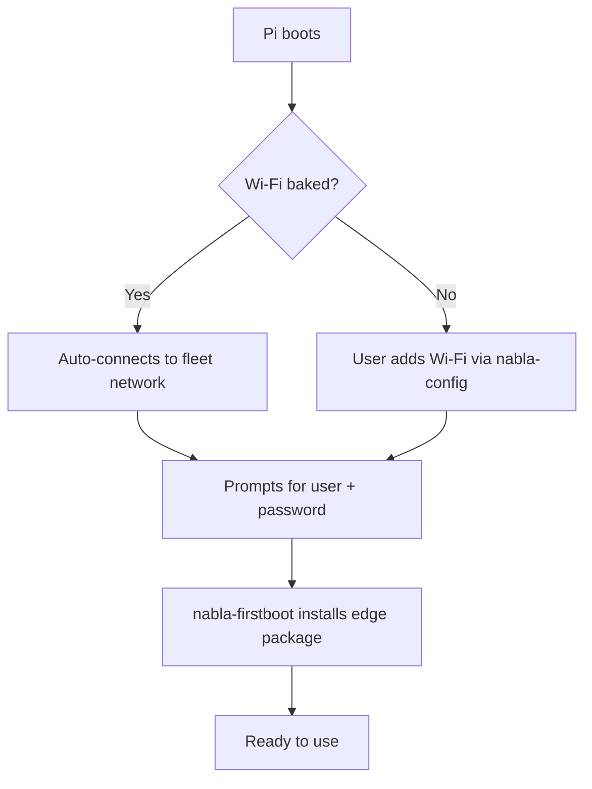
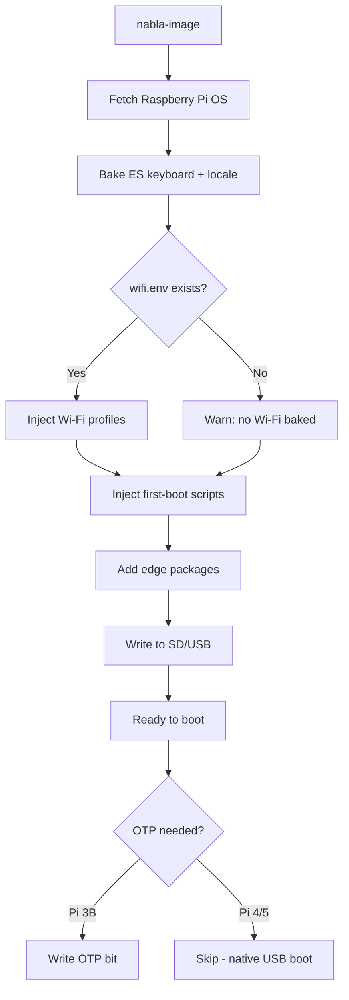
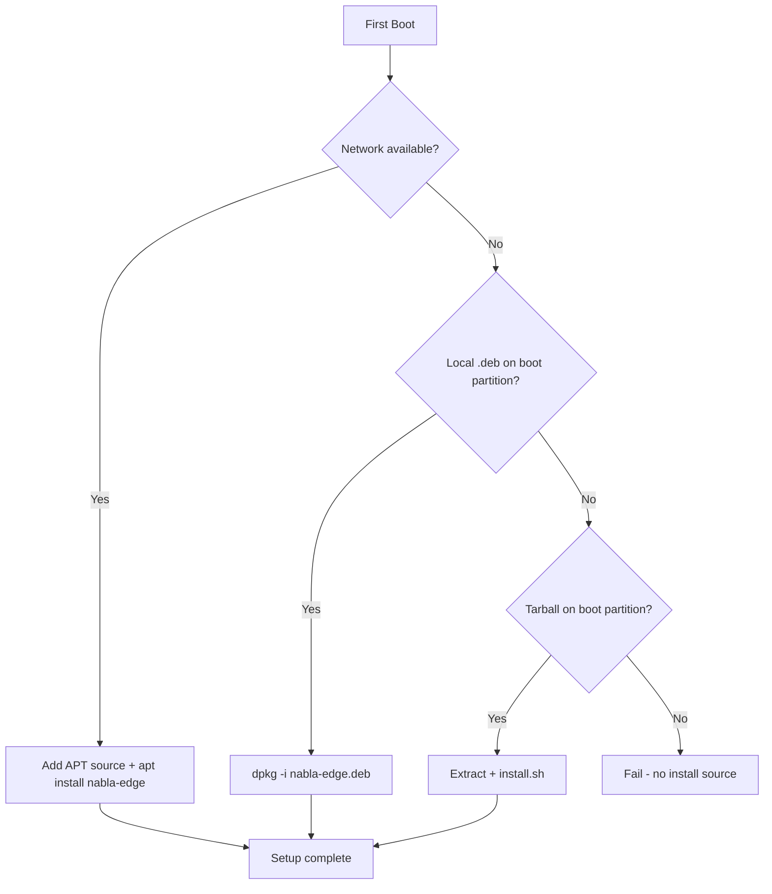

# Imaging — nabla-image

How to create bootable SD/USB media with NablaEdge first-boot injection.

---

## Overview

`nabla-image` (called from `nabla-config` → Media) prepares Raspberry Pi boot media:

1. Fetches Raspberry Pi OS image
2. **Bakes fleet defaults**: ES keyboard, Wi-Fi profiles, SSH enabled
3. Injects first-boot scripts and edge packages
4. Optionally enables OTP USB boot for Pi 3B

**Key design**: First boot only prompts for **user + password**. No Wi-Fi or keyboard questions.

---

## Quick Start

```bash
# List available drives
nabla-image list

# Create image on /dev/sdX (example - use actual device)
sudo nabla-image write-usb /dev/sdX --hostname edge01 --octeto 3
```

**Warning**: This erases all data on the target drive.

---

## What Gets Baked at Image Write Time

| Setting | Value | Source |
|---------|-------|--------|
| Keyboard layout | `es` (Spanish) | Always baked |
| Wi-Fi country | `ES` | Always baked |
| Wi-Fi networks | Fleet SSIDs with priority | From `~/.config/nabla/wifi.env` |
| SSH | Enabled | Always |
| Hostname | Custom | `--hostname` flag |
| Octeto (subnet) | Custom | `--octeto` flag |

**What is NOT baked**: Username and password. The Pi uses Raspberry Pi OS's standard first-login user creation.

---

## Wi-Fi Credentials Setup (Flasher Machine)

Create `~/.config/nabla/wifi.env` on the machine running `nabla-image`:

```bash
mkdir -p ~/.config/nabla
cat > ~/.config/nabla/wifi.env << 'EOF'
# Nabla Wi-Fi Credentials (NEVER commit to git!)
# Priority: higher number = tried first

# Network 1: primary fleet (priority 40)
wifi_ssid_net="CHANGE_ME"
wifi_password_net="CHANGE_ME"

# Network 2: mobile hotspot (priority 30)
wifi_ssid_go="CHANGE_ME"
wifi_password_go="CHANGE_ME"

# Network 3: site-specific (priority 20)
wifi_ssid_villa="CHANGE_ME"
wifi_password_villa="CHANGE_ME"

# Network 4: fallback (priority 10)
wifi_ssid="CHANGE_ME"
wifi_password="CHANGE_ME"
EOF
chmod 600 ~/.config/nabla/wifi.env
```

Alternative path: `~/.config/nabla-wifi.env`

If the file is missing, `nabla-image` warns but continues — the Pi will need manual Wi-Fi setup via `nabla-config`.

---

## First Boot Behavior



**Interactive prompts on first boot**: User + password ONLY

**NOT prompted**: Wi-Fi, keyboard layout, locale (all pre-configured)

---

## The nabla-image Flow



---

## First-Boot Package Installation

The first-boot sequence installs NablaEdge on the new Pi. There are two approaches:

### Current Method (Tarball)

Today, imaged media includes a tarball on the boot partition:

```
/boot/nabla-edge.tar.gz
```

The first-boot script extracts and runs `install.sh`:

```bash
# In /boot/firstboot.d/04-install-packages.sh (current)
cd /boot
tar xzf nabla-edge.tar.gz
cd nabla-edge && ./install.sh
```

The tarball is fetched during imaging from:

```
https://coco.nabla.net/nabla.net/pkgs/nabla-edge.tar.gz
```

### Target Method (APT-First)

Future imaging will prefer APT installation with fallbacks:



Target first-boot logic (pseudocode):

```bash
# In /boot/firstboot.d/04-install-packages.sh (target)

# Try APT first (requires network)
if ping -c1 coco.nabla.net &>/dev/null; then
    echo 'deb [trusted=yes] https://coco.nabla.net/apt/ stable main' > \
        /etc/apt/sources.list.d/nabla.list
    apt update && apt install -y nabla-edge
    exit 0
fi

# Fallback: local .deb on boot partition
if [ -f /boot/nabla-edge*.deb ]; then
    dpkg -i /boot/nabla-edge*.deb
    exit 0
fi

# Fallback: tarball (legacy)
if [ -f /boot/nabla-edge.tar.gz ]; then
    cd /boot && tar xzf nabla-edge.tar.gz
    cd nabla-edge && ./install.sh
    exit 0
fi

echo "ERROR: No install source found"
exit 1
```

### Migration Note

**Important**: To get the new APT-first first-boot behavior, existing imaging Pis must be upgraded. Newly imaged media inherits the first-boot scripts from the Pi that created them.

Upgrade path:
1. Update `nabla-edge` package on the imaging Pi via APT
2. New media written by that Pi will have the APT-first first-boot scripts

---

## What Gets Injected

### First-Boot Scripts

Placed in `/boot/firstboot.d/`:

```
/boot/firstboot.d/
├── 01-expand-filesystem.sh
├── 02-set-hostname.sh
├── 03-configure-network.sh
├── 04-install-packages.sh    ← Package installation
└── 05-start-services.sh
```

These run once on first boot, then self-delete.

### Edge Packages

Depending on the method:

| Method | Location |
|--------|----------|
| Tarball (current) | `/boot/nabla-edge.tar.gz` |
| Local .deb (fallback) | `/boot/nabla-edge_*.deb` |
| APT (target) | Downloaded from `https://coco.nabla.net/apt/` |

### vpn-mode Installation

The `nabla-edge` package installs `vpn-mode` to `/usr/local/bin/`. After first-boot:

```bash
# Enable cable mode (gateway with WiFi uplink)
sudo vpn-mode cable

# Or via nabla-config menu
sudo nabla-config network
```

For gateway Pis that will serve DHCP to client Pis, enable cable mode. See
[../network-modes/](../network-modes/) for details on modes and configuration.

### Configuration Files

Placed in `/boot/nabla/`:

```
/boot/nabla/
├── site.conf           # Site identifier
├── network.conf        # Initial network mode
└── accessories.conf    # Hardware flags
```

---

## OTP USB Boot (Pi 3B)

The Raspberry Pi 3B requires a one-time OTP (One-Time Programmable) bit to enable USB boot.

### Why OTP?

- Pi 3B doesn't boot from USB by default
- OTP bit permanently enables USB boot capability
- Only needs to be set once per Pi

### Enabling OTP

```bash
# Via nabla-image
sudo nabla-image --enable-otp

# Manual method (on running Pi)
echo program_usb_boot_mode=1 | sudo tee -a /boot/config.txt
sudo reboot
# After reboot, remove the line from config.txt
```

### Verification

```bash
vcgencmd otp_dump | grep 17:
# Should show: 17:3020000a (bit set)
```

**Note**: Pi 4 and Pi 5 support USB boot natively — no OTP needed.

---

## USB Hotplug Dialog

When running `nabla-config`, inserting a USB drive triggers a dialog:

| Option | Action |
|--------|--------|
| **Write OS** | Launch nabla-image to write to the drive |
| **OTP Enable** | Write OTP bit for USB boot (Pi 3B) |
| **Open Files** | Mount and browse the drive |
| **Nothing** | Ignore the drive |

This is triggered via udev rules calling `nabla-config --usb-dialog`.

---

## Command Reference

```
nabla-image [COMMAND] [OPTIONS]

COMMANDS:
  list                    List available block devices
  fetch-base [--lite|--desktop]
                          Download and cache Pi OS image
  write-usb DEVICE [OPTIONS]
                          Write Nabla Pi OS to device
  write-sd DEVICE         Alias for write-usb
  write-otp DEVICE        Write OTP enabler for Pi 3B USB boot

OPTIONS for write-usb/write-sd:
  --lite                  Use Pi OS Lite (default)
  --desktop               Use Pi OS Desktop
  --hostname NAME         Set Pi hostname
  --octeto N              Set subnet octeto (10.100.N.0/24)

ENVIRONMENT:
  NABLA_WIFI_ENV          Override Wi-Fi credentials file path
  NABLA_EDGE_TAR          Path to nabla-edge.tar.gz
```

### Examples

```bash
# Basic write with hostname
sudo nabla-image write-usb /dev/sdb --hostname edge01

# Desktop image with octeto
sudo nabla-image write-usb /dev/sdb --desktop --hostname gateway --octeto 3

# Cache the base image first
sudo nabla-image fetch-base --desktop

# OTP enabler for Pi 3B
sudo nabla-image write-otp /dev/sdb
```

---

## Image Sources

### Official Raspberry Pi OS

Default source — fetched automatically:

```
https://downloads.raspberrypi.org/raspios_lite_arm64/images/
```

### Custom Image

Specify with `--image`:

```bash
nabla-image --target /dev/sdX --image /path/to/custom.img.xz
```

---

## Safety Features

1. **Device validation** — Refuses to write to system drives
2. **Confirmation prompt** — Shows target device info before write (via nabla-config)
3. **Protected devices** — Won't overwrite usbdata volumes

---

## Troubleshooting

### "Device busy"

```bash
# Unmount all partitions
sudo umount /dev/sdX*
```

### "Permission denied"

```bash
# Run with sudo
sudo nabla-image write-usb /dev/sdX
```

### Wi-Fi not working on first boot

1. Check if `wifi.env` existed on flasher machine:
   ```bash
   ls -la ~/.config/nabla/wifi.env
   ```
2. If missing, the image boots without Wi-Fi — add manually:
   ```bash
   sudo nabla-config  # → Network
   ```

### First-boot service doesn't run

Check the flag file and service:

```bash
ls -la /boot/firmware/nabla-firstboot.flag
systemctl status nabla-firstboot.service
journalctl -u nabla-firstboot.service
```

### First-boot package install fails

Check logs:

```bash
cat /var/log/nabla-firstboot.log
```

If network wasn't available, APT failed and tarball install was attempted.

---

## Implementation Status

| Task ID | Description | Status |
|---------|-------------|--------|
| IMG-06 | ES keyboard baked at image write | ✅ Done |
| IMG-07 | Wi-Fi profiles from host env file | ✅ Done |
| IMG-08 | First boot prompts user+password only | ✅ Done |

---

## Security Notes

- **NEVER** commit real Wi-Fi passwords to git
- `wifi.env` lives only on the flasher machine (`~/.config/nabla/`)
- Passwords are injected into the image at write time, not stored in repo
- The `.gitignore` blocks `*.env`, `wifi.env`, and similar patterns

---

## How to Change This

1. Edit first-boot scripts in `nablaedge/scripts/image/firstboot/`
2. Edit `nabla-image` in `nablaedge/scripts/`
3. Test on real hardware before documenting
4. Keep example values sanitized (no real hostnames/IPs)

---

## Related

- [../packages-apt/](../packages-apt/) — APT repository and tarball install
- [../pi-config-menu/](../pi-config-menu/) — Post-boot configuration
- [../network-modes/](../network-modes/) — Network setup after boot
- [`../../scripts/image/wifi.env.example`](../../scripts/image/wifi.env.example) — Wi-Fi template
