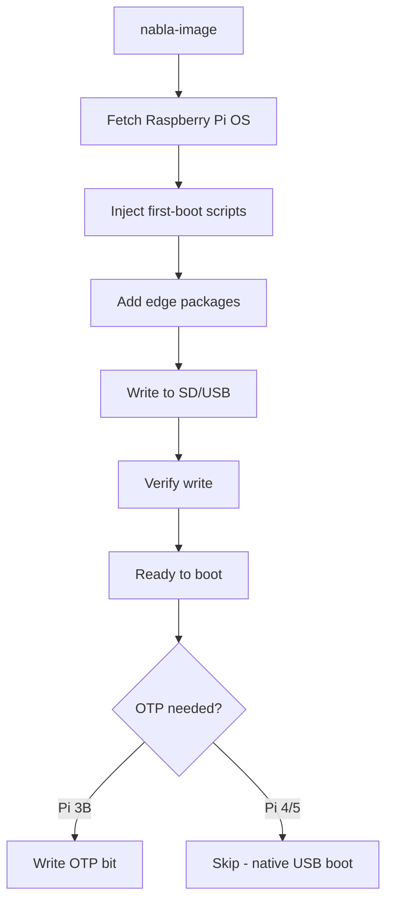

# Imaging — nabla-image

How to create bootable SD/USB media with NablaEdge first-boot injection.

---

## Overview

`nabla-image` prepares Raspberry Pi boot media:

1. Fetches Raspberry Pi OS image
2. Injects first-boot scripts and edge packages
3. Writes to SD card or USB drive
4. Optionally enables OTP USB boot for Pi 3B

---

## Quick Start

```bash
# List available drives
nabla-image --list

# Create image on /dev/sdX (example - use actual device)
sudo nabla-image --target /dev/sdX --site demo
```

**Warning**: This erases all data on the target drive.

---

## The nabla-image Flow



---

## What Gets Injected

### First-Boot Scripts

Placed in `/boot/firstboot.d/`:

```
/boot/firstboot.d/
├── 01-expand-filesystem.sh
├── 02-set-hostname.sh
├── 03-configure-network.sh
├── 04-install-packages.sh
└── 05-start-services.sh
```

These run once on first boot, then self-delete.

### Edge Packages

Pre-staged in `/var/cache/apt/archives/`:

- `nabla-edge` — Core edge system
- `nabla-net` — Network management
- `nabla-oled` — OLED display service
- `nabla-config` — Configuration tool

First-boot script runs `dpkg -i` to install.

### Configuration Files

Placed in `/boot/nabla/`:

```
/boot/nabla/
├── site.conf           # Site identifier
├── network.conf        # Initial network mode
└── accessories.conf    # Hardware flags
```

---

## Package Source

Packages are fetched from a central HTTP mirror (not stored in this repo):

```
https://apt.example.local/nabla/pool/main/
```

Or from local file mirror:

```
file:///path/to/mirror/pool/main/
```

**Note**: Replace `example.local` with your actual mirror. See [../packages-apt/](../packages-apt/) for setting up a mirror.

---

## OTP USB Boot (Pi 3B)

The Raspberry Pi 3B requires a one-time OTP (One-Time Programmable) bit to enable USB boot.

### Why OTP?

- Pi 3B doesn't boot from USB by default
- OTP bit permanently enables USB boot capability
- Only needs to be set once per Pi

### Enabling OTP

```bash
# Via nabla-image
sudo nabla-image --enable-otp

# Manual method (on running Pi)
echo program_usb_boot_mode=1 | sudo tee -a /boot/config.txt
sudo reboot
# After reboot, remove the line from config.txt
```

### Verification

```bash
vcgencmd otp_dump | grep 17:
# Should show: 17:3020000a (bit set)
```

**Note**: Pi 4 and Pi 5 support USB boot natively — no OTP needed.

---

## USB Hotplug Dialog

When running `nabla-config`, inserting a USB drive triggers a dialog:

| Option | Action |
|--------|--------|
| **Write OS** | Launch nabla-image to write to the drive |
| **OTP Enable** | Write OTP bit for USB boot (Pi 3B) |
| **Open Files** | Mount and browse the drive |
| **Nothing** | Ignore the drive |

This is triggered via udev rules calling `nabla-config --usb-dialog`.

---

## Command Reference

```
nabla-image [OPTIONS]

OPTIONS:
  --help, -h              Show help
  --list                  List available target drives
  --target DEVICE         Target device (e.g., /dev/sdb)
  --site NAME             Site identifier (default: demo)
  --image URL             Custom image URL (default: latest Pi OS)
  --mirror URL            Package mirror URL
  --enable-otp            Enable USB boot OTP on Pi 3B
  --dry-run               Show what would be done
  --verify                Verify write after completion
```

---

## Image Sources

### Official Raspberry Pi OS

Default source — fetched automatically:

```
https://downloads.raspberrypi.org/raspios_lite_arm64/images/
```

### Custom Image

Specify with `--image`:

```bash
nabla-image --target /dev/sdX --image /path/to/custom.img.xz
```

---

## Safety Features

1. **Device validation** — Refuses to write to system drives
2. **Confirmation prompt** — Shows target device info before write
3. **Dry-run mode** — Preview without writing
4. **Verification** — Optional post-write verification

---

## Troubleshooting

### "Device busy"

```bash
# Unmount all partitions
sudo umount /dev/sdX*
```

### "Permission denied"

```bash
# Run with sudo
sudo nabla-image --target /dev/sdX
```

### First-boot doesn't run

Check `/boot/firstboot.d/` exists and scripts are executable:

```bash
ls -la /boot/firstboot.d/
```

---

## How to Change This

1. Edit first-boot scripts in the packaging repo
2. Update package list in nabla-image source
3. Test on real hardware before documenting
4. Keep example values sanitized (no real hostnames/IPs)

---

## Related

- [../packages-apt/](../packages-apt/) — Package repository setup
- [../pi-config-menu/](../pi-config-menu/) — Post-boot configuration
- [../network-modes/](../network-modes/) — Network setup after boot
