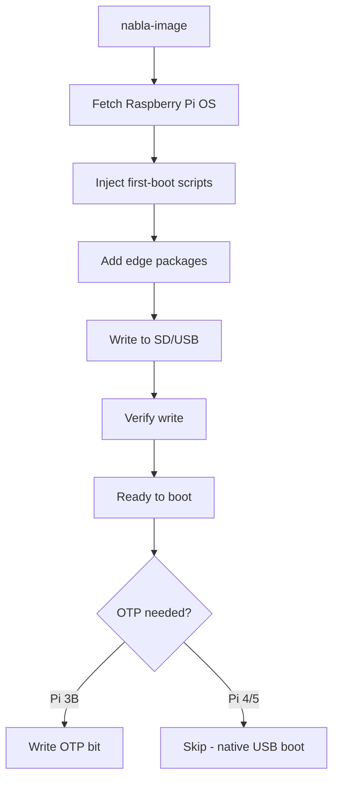

# Imaging — nabla-image

How to create bootable SD/USB media with NablaEdge first-boot injection.

---

## Overview

`nabla-image` (called from `nabla-config` → Media) prepares Raspberry Pi boot media:

1. Fetches Raspberry Pi OS image
2. Writes to SD card or USB drive
3. Injects first-boot scripts and edge packages
4. Optionally enables OTP USB boot for Pi 3B

---

## Quick Start

```bash
# List available drives
nabla-image --list

# Create image on /dev/sdX (example - use actual device)
sudo nabla-image --target /dev/sdX --site demo
```

**Warning**: This erases all data on the target drive.

---

## The nabla-image Flow



---

## First-Boot Package Installation

The first-boot sequence installs NablaEdge on the new Pi. There are two approaches:

### Current Method (Tarball)

Today, imaged media includes a tarball on the boot partition:

```
/boot/nabla-edge.tar.gz
```

The first-boot script extracts and runs `install.sh`:

```bash
# In /boot/firstboot.d/04-install-packages.sh (current)
cd /boot
tar xzf nabla-edge.tar.gz
cd nabla-edge && ./install.sh
```

The tarball is fetched during imaging from:

```
https://coco.nabla.net/nabla.net/pkgs/nabla-edge.tar.gz
```

### Target Method (APT-First)

Future imaging will prefer APT installation with fallbacks:

```mermaid
flowchart TD
    Boot[First Boot] --> Network{Network available?}
    Network -->|Yes| APT[Add APT source + apt install nabla-edge]
    Network -->|No| LocalDeb{Local .deb on boot partition?}
    APT --> Done[Setup complete]
    LocalDeb -->|Yes| Dpkg[dpkg -i nabla-edge.deb]
    LocalDeb -->|No| Tarball{Tarball on boot partition?}
    Dpkg --> Done
    Tarball -->|Yes| Extract[Extract + install.sh]
    Tarball -->|No| Fail[Fail - no install source]
    Extract --> Done
```



Target first-boot logic (pseudocode):

```bash
# In /boot/firstboot.d/04-install-packages.sh (target)

# Try APT first (requires network)
if ping -c1 coco.nabla.net &>/dev/null; then
    echo 'deb [trusted=yes] https://coco.nabla.net/apt/ stable main' > \
        /etc/apt/sources.list.d/nabla.list
    apt update && apt install -y nabla-edge
    exit 0
fi

# Fallback: local .deb on boot partition
if [ -f /boot/nabla-edge*.deb ]; then
    dpkg -i /boot/nabla-edge*.deb
    exit 0
fi

# Fallback: tarball (legacy)
if [ -f /boot/nabla-edge.tar.gz ]; then
    cd /boot && tar xzf nabla-edge.tar.gz
    cd nabla-edge && ./install.sh
    exit 0
fi

echo "ERROR: No install source found"
exit 1
```

### Migration Note

**Important**: To get the new APT-first first-boot behavior, existing imaging Pis must be upgraded. Newly imaged media inherits the first-boot scripts from the Pi that created them.

Upgrade path:
1. Update `nabla-edge` package on the imaging Pi via APT
2. New media written by that Pi will have the APT-first first-boot scripts

---

## What Gets Injected

### First-Boot Scripts

Placed in `/boot/firstboot.d/`:

```
/boot/firstboot.d/
├── 01-expand-filesystem.sh
├── 02-set-hostname.sh
├── 03-configure-network.sh
├── 04-install-packages.sh    ← Package installation
└── 05-start-services.sh
```

These run once on first boot, then self-delete.

### Edge Packages

Depending on the method:

| Method | Location |
|--------|----------|
| Tarball (current) | `/boot/nabla-edge.tar.gz` |
| Local .deb (fallback) | `/boot/nabla-edge_*.deb` |
| APT (target) | Downloaded from `https://coco.nabla.net/apt/` |

### Configuration Files

Placed in `/boot/nabla/`:

```
/boot/nabla/
├── site.conf           # Site identifier
├── network.conf        # Initial network mode
└── accessories.conf    # Hardware flags
```

---

## OTP USB Boot (Pi 3B)

The Raspberry Pi 3B requires a one-time OTP (One-Time Programmable) bit to enable USB boot.

### Why OTP?

- Pi 3B doesn't boot from USB by default
- OTP bit permanently enables USB boot capability
- Only needs to be set once per Pi

### The OTP Enabler SD (Recommended)

The **OTP enabler** is a minimal bootable SD image (~50-100MB) that:

- Displays diagnostic text on HDMI
- Shows Pi model, serial number, hardware info
- Scans attached USB drives for Nabla OS
- Programs the OTP fuse automatically
- Fits on a **256MB SD card**

```bash
# Create OTP enabler SD
sudo nabla-image write-otp /dev/sdX
```

#### Display Output

```
    NABLA OTP ENABLER
    Programming USB boot fuse (Pi 3B)

    Hardware
    Model:    Raspberry Pi 3 Model B Rev 1.2
    Serial:   00000000abcd1234

    OTP Status
    OK USB boot fuse programmed by GPU firmware

    USB Storage
    /dev/sda: 32GB SanDisk Cruzer
    USB: Nabla OS detected on /dev/sda1

    System will halt in 120 seconds
```

#### Using the OTP Enabler

1. Write OTP enabler to SD: `sudo nabla-image write-otp /dev/sdX`
2. Insert SD into Pi 3B
3. Connect HDMI monitor
4. Power on and verify display output
5. Wait for countdown to complete
6. Power off when finished, then remove this SD to boot from USB

See [`../../scripts/otp-enabler/README.md`](../../scripts/otp-enabler/README.md) for full details.

### Manual Method (Legacy)

If you have a running Pi OS, you can enable OTP manually:

```bash
echo program_usb_boot_mode=1 | sudo tee -a /boot/config.txt
sudo reboot
# After reboot, remove the line from config.txt
```

### Verification

After OTP programming, verify the fuse was burned:

```bash
vcgencmd otp_dump | grep 17:
```

**Expected output:**
```
17:3020000a
```

If you see `17:1020000a`, the fuse was not programmed. Re-run the OTP enabler.

**Note**: Pi 4 and Pi 5 support USB boot natively — no OTP needed.

---

## USB Hotplug Dialog

When running `nabla-config`, inserting a USB drive triggers a dialog:

| Option | Action |
|--------|--------|
| **Write OS** | Launch nabla-image to write to the drive |
| **OTP Enable** | Write OTP bit for USB boot (Pi 3B) |
| **Open Files** | Mount and browse the drive |
| **Nothing** | Ignore the drive |

This is triggered via udev rules calling `nabla-config --usb-dialog`.

---

## Command Reference

```
nabla-image COMMAND [OPTIONS]

COMMANDS:
  write-usb DEVICE        Write Nabla Pi OS to USB/SD drive
      --desktop           Use desktop image
      --lite              Use lite image (default)
      --hostname NAME     Set hostname (default: edge)
      --octeto N          Subnet 10.100.N.0/24 (default: 3)
      --site NAME         Site identifier (default: demo)

  write-otp DEVICE        Write OTP enabler for Pi 3B USB boot
                          Creates tiny diagnostic SD (~50MB)

  build-otp               Build OTP enabler image file only

  fetch-base TYPE         Download base image (desktop or lite)

OPTIONS:
  --list, -l              List available target drives
  --help, -h              Show help
```

### Examples

```bash
# List available drives
sudo nabla-image --list

# Write Nabla Pi OS lite to USB
sudo nabla-image write-usb /dev/sdb --lite --hostname mypi

# Write OTP enabler to SD (Pi 3B only)
sudo nabla-image write-otp /dev/sdc

# Build OTP image without writing
nabla-image build-otp
```

---

## Image Sources

### Official Raspberry Pi OS

Default source — fetched automatically:

```
https://downloads.raspberrypi.org/raspios_lite_arm64/images/
```

### Custom Image

Specify with `--image`:

```bash
nabla-image --target /dev/sdX --image /path/to/custom.img.xz
```

---

## Safety Features

1. **Device validation** — Refuses to write to system drives
2. **Confirmation prompt** — Shows target device info before write
3. **Dry-run mode** — Preview without writing
4. **Verification** — Optional post-write verification

---

## Troubleshooting

### "Device busy"

```bash
# Unmount all partitions
sudo umount /dev/sdX*
```

### "Permission denied"

```bash
# Run with sudo
sudo nabla-image --target /dev/sdX
```

### First-boot doesn't run

Check `/boot/firstboot.d/` exists and scripts are executable:

```bash
ls -la /boot/firstboot.d/
```

### First-boot APT install fails

If network isn't available at first-boot, the APT method will fail and fall back to local .deb or tarball. To debug:

```bash
# Check firstboot logs
journalctl -u firstboot
cat /var/log/firstboot.log
```

---

## How to Change This

1. Edit first-boot scripts in the packaging repo
2. Update package list in nabla-image source
3. Test on real hardware before documenting
4. Keep example values sanitized (no real hostnames/IPs)

---

## Related

- [../packages-apt/](../packages-apt/) — APT repository and tarball install
- [../pi-config-menu/](../pi-config-menu/) — Post-boot configuration
- [../network-modes/](../network-modes/) — Network setup after boot
