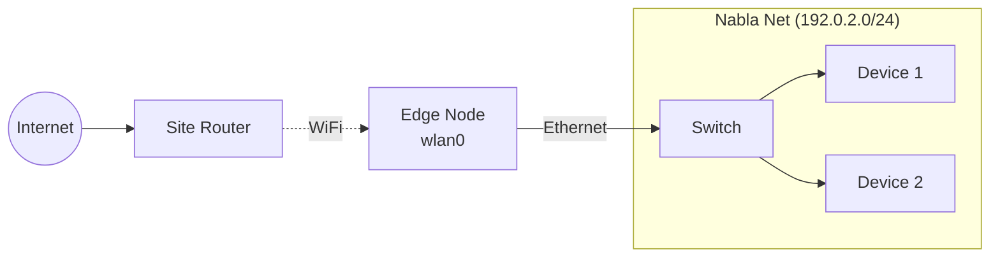
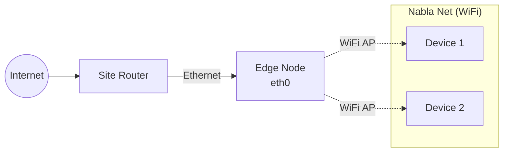
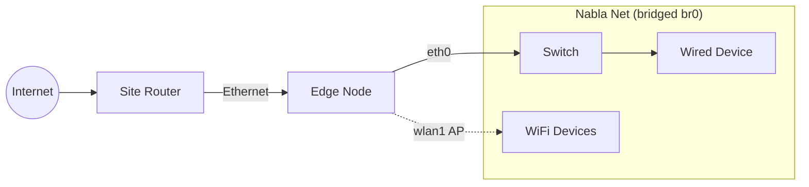

# Network Modes

How Nabla Net modes work: `cable` | `ap` | `cable-ap` | `off` | `status`.

Managed by `nabla-net` (or legacy `vpn-mode`) script.

---

## Mode Overview

| Mode | Uplink (Internet) | Nabla Net (Local) | Use Case |
|------|-------------------|-------------------|----------|
| `cable` | WiFi client | Ethernet LAN + NAT | Pi near Ethernet, WiFi to router |
| `ap` | Ethernet | WiFi AP | Pi wired, creates WiFi for devices |
| `cable-ap` | Ethernet | Ethernet + WiFi AP (bridged) | Dual-interface gateway |
| `off` | None | None | Maintenance, isolated |

---

## Mode: cable

**WiFi uplink → Ethernet LAN → NAT**



**How it works:**
- `wlan0` connects to upstream WiFi (client mode)
- `eth0` serves as Nabla Net LAN
- NAT routes Nabla Net traffic through WiFi
- Pi advertises routes for Nabla Net subnet

**Configuration:**
```bash
sudo nabla-net set-mode cable
```

**When to use:** Pi has WiFi access to router, provides wired LAN for edge devices.

---

## Mode: ap

**Ethernet uplink → WiFi AP**



**How it works:**
- `eth0` connects to upstream network
- `wlan0` broadcasts WiFi AP (SSID: `NablaNet` or custom)
- DHCP server on `wlan0` for AP clients
- NAT routes AP traffic through Ethernet

**Configuration:**
```bash
# First configure AP credentials
sudo nabla-config --network
# → WiFi → Set SSID and password

# Then enable AP mode
sudo nabla-net set-mode ap
```

**AP credentials** stored in `~/.config/nabla-net-ap.env`:
```bash
AP_SSID="NablaNet"
AP_PASSWORD="CHANGE_ME"  # Must be 8+ characters
```

**When to use:** Pi has Ethernet, creates WiFi network for wireless edge devices.

---

## Mode: cable-ap

**Ethernet LAN + Second Radio WiFi AP (bridged)**



**How it works:**
- `eth0` provides Ethernet LAN
- `wlan1` (second WiFi adapter) broadcasts AP
- Both bridged to `br0` — same subnet
- Single DHCP pool serves both wired and wireless

**Requirements:**
- Second WiFi adapter (USB dongle) for `wlan1`
- Or use single radio with AP+client simultaneously (chipset dependent)

**Configuration:**
```bash
sudo nabla-net set-mode cable-ap
```

**When to use:** Need both wired and wireless on same Nabla Net subnet.

---

## Mode: off

**Networking disabled**

```bash
sudo nabla-net set-mode off
```

Stops all networking services:
- hostapd (AP)
- dnsmasq (DHCP)
- wpa_supplicant (WiFi client)
- Blocks WiFi radio

**When to use:** Initial imaging, recovery, or standalone operation.

---

## Checking Status

```bash
# Via script
nabla-net status

# Example output:
nabla-net v0.5 — Network Status
=====================================

Mode: cable-ap

Interfaces:
  eth0: UP 192.0.2.10/24
  wlan0: UP (no IP - bridged)
  br0: UP 192.0.2.1/24

Services:
  hostapd: active
  dnsmasq: active
  wpa_supplicant: inactive

AP active: NablaNet
AP clients: 2
```

---

## Subnet Pattern

Documentation uses RFC 5737 reserved ranges:

| Range | Use |
|-------|-----|
| `192.0.2.0/24` | TEST-NET-1 (examples) |
| `198.51.100.0/24` | TEST-NET-2 |
| `203.0.113.0/24` | TEST-NET-3 |

**Example Nabla Net layout:**
```
Gateway (Pi):     192.0.2.1
DHCP pool:        192.0.2.100 - 192.0.2.200
Static devices:   192.0.2.10 - 192.0.2.50
```

In production, use your own private subnet (10.x, 172.16-31.x, 192.168.x).

---

## Public PDFs

| File | Content |
|------|---------|
| [nabla-edge-ejemplos.pdf](pdf/nabla-edge-ejemplos.pdf) | Two connection patterns: WiFi-in/cable-out vs cable-in/WiFi-out |

---

## Script Reference

See [`../../scripts/nabla-net`](../../scripts/nabla-net) for full implementation.

```bash
nabla-net set-mode <mode>   # Switch mode
nabla-net status            # Show current state
nabla-net restart           # Restart current mode
```

---

## How to Change This

1. **Add a mode**: Create `apply_mode_*()` function in `nabla-net`
2. **Change subnet**: Edit DHCP config in mode apply functions
3. **Add service**: Integrate new daemon into mode lifecycle

---

## Related

- [`../../scripts/nabla-net`](../../scripts/nabla-net) — Mode manager script
- [../pi-config-menu/](../pi-config-menu/) — Interactive configuration
- [../architecture/](../architecture/) — Three-layer network concept
