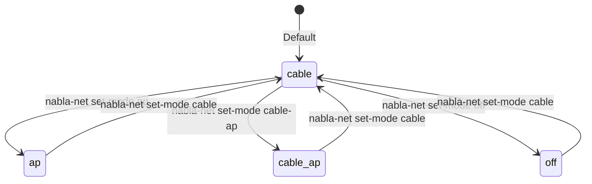

# Network Modes — Nabla Net

How Nabla Net LAN modes work: `cable` | `ap` | `cable-ap` | `off`.

---

## Overview

Nabla Net manages the local network for edge nodes. Each Pi can operate in one of four modes:

| Mode | Uplink | LAN AP | Use Case |
|------|--------|--------|----------|
| `cable` | Ethernet | No | Node connects to existing network |
| `ap` | WiFi client | Yes | Node creates WiFi AP, uplinks via WiFi |
| `cable-ap` | Ethernet | Yes | Node creates WiFi AP, uplinks via Ethernet |
| `off` | None | No | Networking disabled |

---

## Mode: cable

**Ethernet uplink, no WiFi AP**


The simplest mode:
- Pi connects via Ethernet cable
- Gets IP from upstream DHCP
- No WiFi broadcasting

**When to use**: Node near Ethernet, no need for local WiFi.

---

## Mode: ap

**WiFi AP with WiFi client uplink**


Dual WiFi radio mode:
- Primary radio: Connect to upstream WiFi
- Secondary radio (or same via AP mode): Broadcast local AP

**When to use**: No Ethernet available, need local WiFi for other devices.

**Note**: Requires dual-band adapter or compatible chipset for simultaneous client+AP.

---

## Mode: cable-ap

**Ethernet uplink + WiFi AP**


Most common gateway mode:
- Ethernet provides reliable uplink
- WiFi broadcasts local AP for edge devices

**When to use**: Primary gateway node with Ethernet access.

---

## Mode: off

**Networking disabled**

For maintenance or isolated operation:
- No network interfaces active
- Node operates standalone
- Use for initial imaging or recovery

---

## Subnet Pattern

Nabla Net uses a documentation-safe subnet pattern:

```
192.0.2.0/24   (TEST-NET-1, RFC 5737)
```

In actual deployments, you would use your own private subnet. The `192.0.2.x` range is reserved for documentation and never routed on the internet.

**Example configuration** (not real values):

```
Gateway:   192.0.2.1
DHCP pool: 192.0.2.100 - 192.0.2.200
Node IPs:  192.0.2.10, 192.0.2.11, ...
```

---

## Configuration

### Via nabla-config

```bash
sudo nabla-config --network
# Select "Modo de red" → choose mode
```

### Via config file

Edit `/etc/nabla-net/network.conf`:

```ini
# Network mode
mode=cable-ap

# WiFi AP settings (used when mode includes 'ap')
ap_ssid=CHANGE_ME
ap_password=CHANGE_ME
ap_channel=6
ap_band=2.4GHz
```

### Environment file

For sensitive values, use `/etc/nabla-net/wifi.env`:

```bash
# WiFi credentials - CHANGE THESE
WIFI_SSID=CHANGE_ME
WIFI_PASSWORD=CHANGE_ME
```

---

## Checking Status

```bash
# Via nabla-config
sudo nabla-config --network
# Select "Estado"

# Direct command
nabla-net status
```

Output example:

```
Mode: cable-ap
Uplink: eth0 (connected)
  IP: 192.0.2.50/24
  Gateway: 192.0.2.1
AP: wlan0 (active)
  SSID: nabla-demo
  Clients: 2
```

---

## How Mode Switching Works



When mode changes:

1. `nabla-net` stops current services
2. Reconfigures interfaces
3. Starts services for new mode
4. Updates `/etc/nabla-net/network.conf`

---

## Bridged vs Routed

### Bridged (Layer 2)

All devices on same subnet:

```
Upstream: 192.0.2.0/24
   ↓ (bridged)
Nabla Net: 192.0.2.0/24
```

Simpler, but upstream sees all devices.

### Routed (Layer 3)

Separate subnets with NAT:

```
Upstream: 192.0.2.0/24
   ↓ (NAT)
Nabla Net: 198.51.100.0/24
```

More isolation, Pi acts as router.

Current implementation uses **bridged** mode for simplicity.

---

## PDFs

Reference materials in [pdf/](pdf/):

| File | Content |
|------|---------|
| `nabla-edge-ejemplos.pdf` | Network configuration examples |

*(Binary PDFs to be committed separately)*

---

## How to Change This

1. Edit this `README.md` for concept changes
2. Add examples to `pdf/` (after sanitization check)
3. Update `nabla-config` menu if adding options
4. Keep placeholder IPs (`192.0.2.x`) and SSIDs (`CHANGE_ME`)

---

## Related

- [../pi-config-menu/](../pi-config-menu/) — nabla-config tool
- [../architecture/](../architecture/) — System overview
