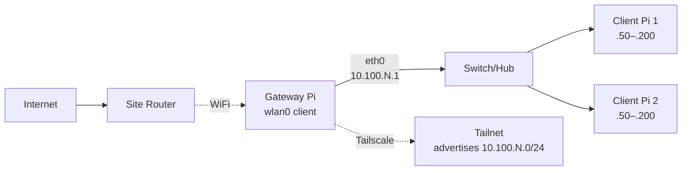
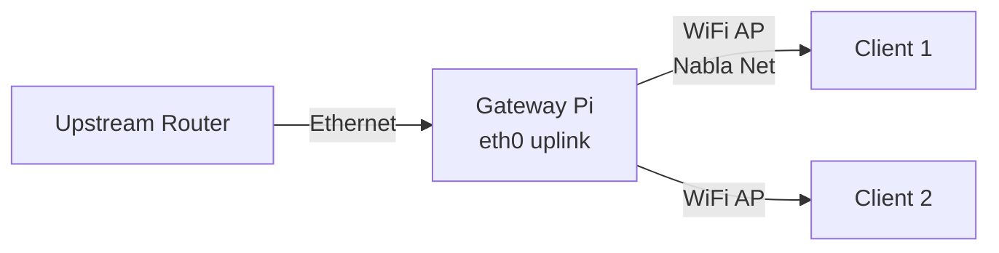
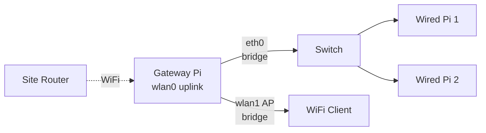

# Network Modes — Nabla Net

How Nabla Net LAN modes work via `vpn-mode`: `cable` | `ap` | `cable-ap` | `off` | `status`.

Golden reference: verified on gateway Pis using cable mode with WiFi uplink, eth0 as
private LAN gateway (.1), dnsmasq with `bind-dynamic`, and systemd `Restart=on-failure`.

---

## Overview

Nabla Net provides private LAN gateway functionality for edge node clusters. A gateway
Pi connects to the site network (via WiFi or Ethernet uplink) and provides DHCP to
downstream client Pis on its eth0 interface.

| Mode | Uplink | LAN Interface | DHCP | Use Case |
|------|--------|---------------|------|----------|
| `cable` | WiFi | eth0 | Yes (.50–.200) | Gateway with WiFi uplink, eth0 serves clients |
| `ap` | Ethernet | WiFi AP | Yes | Node creates WiFi AP, uplinks via eth |
| `cable-ap` | WiFi | eth0 + wlan1 bridged | Yes | Both wired + wireless clients on same subnet |
| `off` | — | — | No | Disable gateway mode |
| `status` | — | — | — | Show current configuration |

---

## Subnet Pattern

Each gateway uses a unique /24 subnet based on its hostname or configured octet:

```
10.100.N.0/24   where N = octet (1–254)
```

| Example Hostname | Octet | Subnet | Gateway IP |
|------------------|-------|--------|------------|
| gateway1 | 1 | 10.100.1.0/24 | 10.100.1.1 |
| gateway2 | 2 | 10.100.2.0/24 | 10.100.2.1 |
| edge-13 | 13 | 10.100.13.0/24 | 10.100.13.1 |

The octet is derived from hostname patterns or set via `VPN_MODE_OCTETO` environment variable.

**DHCP pool**: `.50` – `.200` (12h lease)
**Gateway/router**: `.1`

---

## Mode: cable (Golden Reference)

**WiFi uplink → eth0 gateway for client Pis**

This is the primary gateway mode, verified on production gateways:



**What happens:**

1. Gateway Pi connects to site WiFi (wlan0) — gets upstream IP via DHCP
2. eth0 configured as 10.100.N.1/24 (static)
3. dnsmasq provides DHCP on eth0 (pool .50–.200)
4. nftables NAT forwards client traffic through wlan0
5. Tailscale advertises subnet to tailnet

**Usage:**

```bash
sudo vpn-mode cable
```

**Note:** eth0 often shows NO-CARRIER until a client Pi is physically connected. This is normal — dnsmasq uses `bind-dynamic` to handle interfaces appearing/disappearing.

---

## Mode: ap

**Ethernet uplink → WiFi AP for clients**



- eth0: uplink to router (DHCP client)
- wlan0: Access Point mode (SSID: "Nabla Net")
- Clients connect to WiFi, get 10.100.N.x addresses

**Usage:**

```bash
sudo vpn-mode ap
```

**Requirements:**
- WiFi chipset must support AP mode
- AP password in `~/.config/nabla-net-ap.env`

---

## Mode: cable-ap

**WiFi uplink → eth0 + wlan1 AP bridged**



Both wired (eth0) and wireless (wlan1 AP) clients share the same 10.100.N.0/24 subnet
via a Linux bridge.

**Usage:**

```bash
sudo vpn-mode cable-ap
```

**Requirements:**
- Second WiFi adapter (e.g., USB dongle like Atheros WNA1100)
- AP password in `~/.config/nabla-net-ap.env`

---

## Mode: off

Disables gateway mode and restores normal networking:

```bash
sudo vpn-mode off
```

- Removes NetworkManager connections
- Clears nftables rules
- Disables IP forwarding
- Stops advertising Tailscale subnet

---

## Mode: status

Shows current configuration without changes:

```bash
vpn-mode status
```

Output example:

```
host=gateway1 octeto=1 subnet=10.100.1.0/24
eth=eth0 wlan=wlan0 wlan_ap=none br=br-nabla1 home=/home/pi
state=cable
eth0             UP             52:54:00:12:34:56
wlan0            UP             dc:a6:32:xx:xx:xx
eth0             10.100.1.1/24
wlan0            (upstream DHCP)
vpn-mode-eth-1:eth0:ethernet:activated
1
active
AdvertiseRoutes: [10.100.1.0/24]
```

---

## dnsmasq Configuration

The `vpn-mode` script creates per-octet dnsmasq config at `/etc/dnsmasq.d/vpn-mode-N.conf`:

```ini
interface=eth0
bind-dynamic
dhcp-range=10.100.1.50,10.100.1.200,12h
dhcp-option=option:router,10.100.1.1
dhcp-option=option:dns-server,1.1.1.1,8.8.8.8
domain-needed
bogus-priv
```

### bind-dynamic

The `bind-dynamic` option is **critical** for gateway Pis:

- Allows dnsmasq to bind to interfaces that appear after startup
- Handles eth0 NO-CARRIER state when no client is plugged in
- Survives network reconfigurations without restart

### systemd Drop-in (Restart=on-failure)

A systemd drop-in ensures dnsmasq survives boot races:

**File:** `/etc/systemd/system/dnsmasq.service.d/nabla-vpn-mode.conf`

```ini
[Unit]
After=network-online.target
Wants=network-online.target

[Service]
Restart=on-failure
RestartSec=3
StartLimitIntervalSec=60
StartLimitBurst=20
```

This drop-in is installed automatically by `vpn-mode` on first run.

---

## Tailscale Integration

When gateway mode is enabled, `vpn-mode` automatically:

1. Advertises the subnet to your tailnet:
   ```bash
   tailscale set --advertise-routes="10.100.N.0/24" --accept-routes
   ```

2. On first use, approve the route in Tailscale admin console

3. Remote machines on the tailnet can then reach client Pis directly

---

## AP Password Configuration

Modes that create a WiFi AP (`ap`, `cable-ap`) require an AP password file:

**File:** `~/.config/nabla-net-ap.env`

```bash
NABLA_NET_AP_PASSWORD=YOUR_SECRET_HERE
```

**Important:** This file is NOT committed to git. Create it manually on each gateway.

---

## Environment Variables

Override auto-detection with environment variables:

| Variable | Description | Example |
|----------|-------------|---------|
| `VPN_MODE_OCTETO` | Subnet octet (1–254) | `VPN_MODE_OCTETO=3` |
| `VPN_MODE_ETH` | Ethernet interface | `VPN_MODE_ETH=enp0s3` |
| `VPN_MODE_WLAN` | Primary WiFi interface | `VPN_MODE_WLAN=wlp2s0` |
| `VPN_MODE_WLAN_AP` | Secondary WiFi for cable-ap | `VPN_MODE_WLAN_AP=wlan1` |

---

## Installation

### From nabla-edge package (recommended)

```bash
sudo apt install nabla-edge
# vpn-mode installed to /usr/local/bin/
```

### Manual install

```bash
# Copy script
sudo cp vpn-mode /usr/local/bin/vpn-mode
sudo chmod +x /usr/local/bin/vpn-mode

# Create AP password (if using ap/cable-ap modes)
mkdir -p ~/.config
echo 'NABLA_NET_AP_PASSWORD=YOUR_SECRET_HERE' > ~/.config/nabla-net-ap.env
chmod 600 ~/.config/nabla-net-ap.env
```

### First-boot imaging

When imaging new Pis with `nabla-image`, the first-boot sequence installs `vpn-mode`
to `/usr/local/bin/`. See [../imaging/](../imaging/).

---

## Troubleshooting

### eth0 shows NO-CARRIER

Normal when no client Pi is plugged in. dnsmasq uses `bind-dynamic` to handle this.

### dnsmasq fails at boot

The systemd drop-in handles boot races. Check:

```bash
systemctl status dnsmasq
journalctl -u dnsmasq
```

If it keeps failing, the drop-in may not be installed:

```bash
sudo vpn-mode cable  # reinstalls drop-in
```

### Client Pi doesn't get DHCP

1. Check dnsmasq is running: `systemctl is-active dnsmasq`
2. Check config exists: `cat /etc/dnsmasq.d/vpn-mode-*.conf`
3. Check interface IP: `ip addr show eth0`
4. Try forcing a new DHCP request on client: `sudo dhclient -r eth0 && sudo dhclient eth0`

### Tailscale subnet not reachable

1. Check route is advertised: `tailscale status`
2. Approve route in Tailscale admin console
3. Check IP forwarding: `sysctl net.ipv4.ip_forward` (should be 1)

---

## Command Reference

```
vpn-mode cable|ap|cable-ap|off|status

Modes:
  cable     eth0 is gateway (10.100.N.1/24), WiFi uplink, DHCP for clients
  ap        WiFi AP mode (Nabla Net SSID), eth uplink
  cable-ap  eth LAN + AP on 2nd Wi-Fi (same subnet bridged)
  off       disable LAN gateway, restore normal networking
  status    show current state

Files:
  /etc/dnsmasq.d/vpn-mode-N.conf              dnsmasq config
  /etc/systemd/system/dnsmasq.service.d/      systemd drop-in
  /etc/nftables.d/vpn-mode-N.nft              NAT rules
  /etc/sysctl.d/99-vpn-mode-forward.conf      IP forwarding
  ~/.config/vpn-mode.state                    current mode state
  ~/.config/nabla-net-ap.env                  AP password
```

---

## Related

- [`../../scripts/vpn-mode`](../../scripts/vpn-mode) — The script itself
- [../pi-config-menu/](../pi-config-menu/) — nabla-config GUI wrapper
- [../imaging/](../imaging/) — First-boot installation
- [../packages-apt/](../packages-apt/) — APT installation
