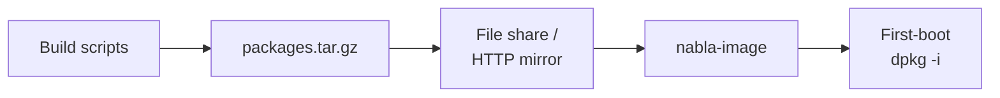
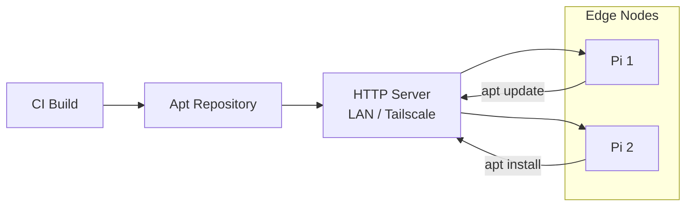

# Packages and Apt

How NablaEdge packages are built and distributed — today's tarball method and target apt repository.

---

## Current: Tarball + install.sh

Today, packages are distributed as tarballs:



### How It Works

1. **Build**: Create `.deb` files from package sources
2. **Bundle**: Combine into `packages.tar.gz`
3. **Serve**: Place on file share or HTTP server
4. **Image**: `nabla-image` fetches and stages in `/boot/nabla/`
5. **Install**: First-boot extracts and runs `dpkg -i`

### Limitations

- Manual version management
- No dependency resolution
- No easy updates after install

---

## Target: Apt over HTTP

Goal architecture:



### Repository Structure

```
/apt/
├── dists/
│   └── stable/
│       ├── main/
│       │   └── binary-arm64/
│       │       ├── Packages
│       │       └── Packages.gz
│       ├── Release
│       └── Release.gpg (optional)
└── pool/
    └── main/
        ├── nabla-edge_1.0.0_arm64.deb
        ├── nabla-net_1.0.0_arm64.deb
        ├── nabla-oled_1.0.0_arm64.deb
        └── nabla-config_1.0.0_arm64.deb
```

### Client Configuration

On edge nodes, add apt source:

```bash
# Add repository (example URL)
echo "deb [trusted=yes] https://apt.example.local/nabla stable main" \
    | sudo tee /etc/apt/sources.list.d/nabla.list

# Update and install
sudo apt update
sudo apt install nabla-edge
```

---

## Packages

| Package | Contents |
|---------|----------|
| `nabla-edge` | Meta-package, pulls dependencies |
| `nabla-net` | Network mode manager, systemd service |
| `nabla-oled` | OLED display service |
| `nabla-config` | Whiptail configuration panel |
| `nabla-menu-tools` | CLI tools for menu YAML/JSON |

### Package Metadata

Control files live in [`../../packages/`](../../../packages/):

```
packages/
├── nabla-edge/
│   ├── DEBIAN/
│   │   ├── control
│   │   ├── postinst
│   │   └── prerm
│   └── build.sh
└── nabla-config/
    └── ...
```

### Example Control File

```
Package: nabla-edge
Version: 1.0.0
Architecture: arm64
Maintainer: NablaEdge <edge@example.local>
Depends: python3, python3-pip, mosquitto-clients
Description: NablaEdge core system
 Edge computing system for home automation.
 Includes network management, OLED display,
 and configuration tools.
```

---

## Publishing Script

Regenerate repository index after adding packages:

```bash
#!/bin/bash
# publish-apt.sh

REPO_ROOT="/var/www/apt"
POOL="$REPO_ROOT/pool/main"
DIST="$REPO_ROOT/dists/stable/main/binary-arm64"

# Generate Packages file
mkdir -p "$DIST"
cd "$REPO_ROOT"
apt-ftparchive packages pool/main > "$DIST/Packages"
gzip -k -f "$DIST/Packages"

# Generate Release file
apt-ftparchive release dists/stable > dists/stable/Release

echo "Repository updated"
```

### Optional: GPG Signing

```bash
# Sign Release file
gpg --armor --sign --detach-sign \
    -o dists/stable/Release.gpg \
    dists/stable/Release

# Create InRelease (clearsigned)
gpg --clearsign \
    -o dists/stable/InRelease \
    dists/stable/Release
```

Clients then import the GPG key:

```bash
curl -fsSL https://apt.example.local/nabla.gpg | sudo apt-key add -
```

---

## Hosting Options

| Server | Notes |
|--------|-------|
| Nginx | Static files, directory listing |
| Caddy | Automatic HTTPS, simple config |
| Apache | Traditional, well-documented |
| Synology Web Station | NAS-based hosting |
| GitHub Releases | For public packages |

### Nginx Example

```nginx
server {
    listen 80;
    server_name apt.example.local;
    
    root /var/www/apt;
    autoindex on;
    
    location / {
        try_files $uri $uri/ =404;
    }
}
```

See [`../../dist/`](../../../dist/) for more serving configuration.

---

## Migration Path

1. **Today**: Tarball via `nabla-image` first-boot
2. **Next**: HTTP apt mirror on LAN
3. **Later**: Tailscale-accessible apt for remote nodes
4. **Future**: Public apt for open-source packages

---

## Building Packages

```bash
# Example build script
cd packages/nabla-config
./build.sh

# Output
# → build/nabla-config_1.0.0_arm64.deb
```

Build scripts:
1. Copy files to staging directory
2. Set permissions
3. Run `dpkg-deb --build`

---

## How to Change This

1. **Add package**: Create folder in `packages/`, add control file
2. **Update version**: Edit `control`, rebuild
3. **Publish**: Run publish script, restart web server if needed

---

## Related

- [`../../packages/`](../../../packages/) — Package metadata
- [`../../dist/`](../../../dist/) — HTTP serving config
- [../imaging/](../imaging/) — First-boot package installation
