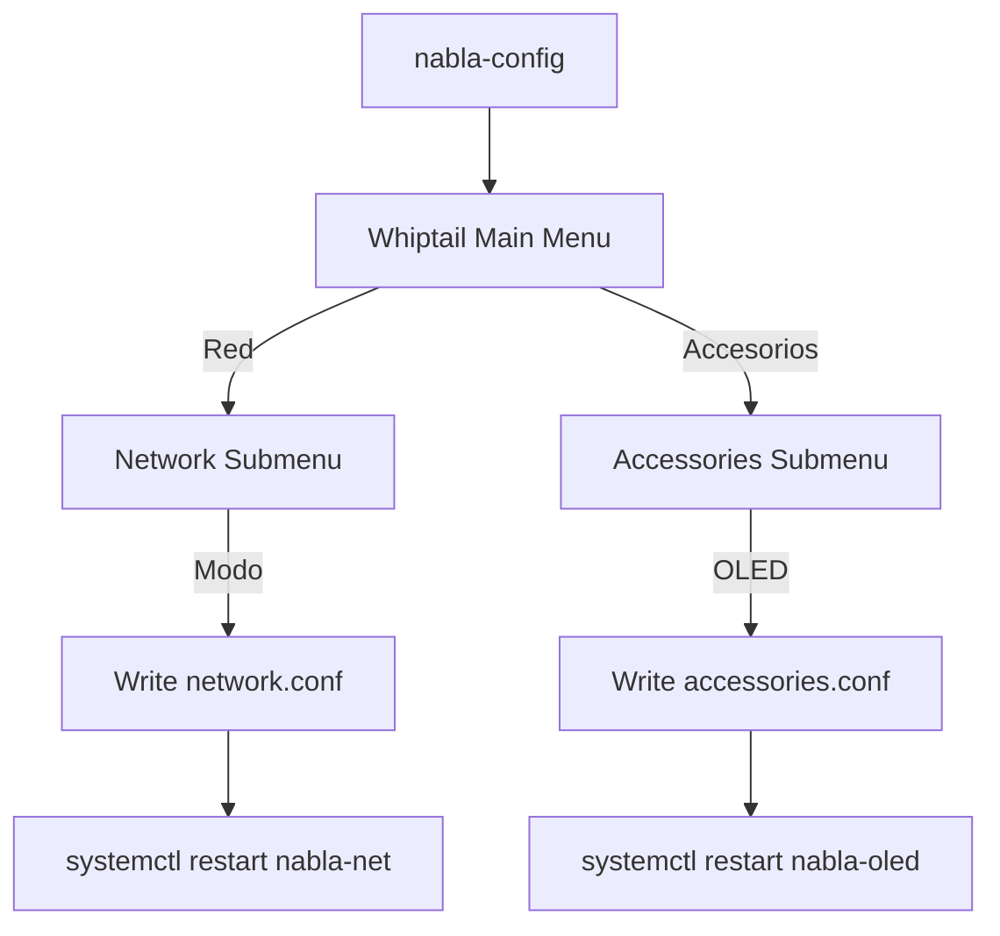

# Pi Config Menu — nabla-config

The `nabla-config` tool: a whiptail-based configuration menu for Raspberry Pi edge nodes.

---

## Installation

`nabla-config` is part of the `nabla-edge` package. Install via APT:

```bash
echo 'deb [trusted=yes] https://coco.nabla.net/apt/ stable main' | \
  sudo tee /etc/apt/sources.list.d/nabla.list
sudo apt update && sudo apt install nabla-edge
```

See [../packages-apt/](../packages-apt/) for full installation details.

---

## What is nabla-config?

`nabla-config` is an interactive terminal menu (using whiptail/dialog) that configures:

- **Red** (Network) — Nabla Net modes, uplink settings
- **Medios** (Media) — Audio/video output configuration
- **Accesorios** (Accessories) — OLED, rotary encoder, large display flags
- **Camera** — Camera module settings
- **Voice** — Voice satellite configuration (HA Assist integration)

---

## Running nabla-config

```bash
# Interactive mode (default)
sudo nabla-config

# Show help
nabla-config --help

# Direct submenu access
sudo nabla-config --network
sudo nabla-config --accessories
```

---

## Menu Tree

```
nabla-config (Main Menu)
├── Red (Network)
│   ├── Modo de red       → cable | ap | cable-ap | off
│   ├── Configurar WiFi   → SSID, password (writes env file)
│   ├── Estado            → Show current network status
│   └── Reiniciar red     → Restart networking services
│
├── Medios (Media)
│   ├── Audio output      → HDMI / 3.5mm / USB
│   └── Display output    → HDMI / composite / none
│
├── Accesorios (Accessories)
│   ├── OLED display      → Enable/disable, I2C address
│   ├── Rotary encoder    → Enable/disable, GPIO pins
│   ├── Large SPI display → Enable/disable SPI display
│   └── Ver configuración → Show current accessories.conf
│
├── Camera
│   ├── Enable camera     → Toggle camera module
│   └── Test camera       → Capture test image
│
└── Voice
    ├── Satellite mode    → Enable HA voice satellite
    └── Wake word         → Configure wake word
```

---

## Configuration Files

### /etc/nabla-net/accessories.conf

Accessory flags file — controls which hardware is enabled:

```ini
# Accessories configuration
# Edit via nabla-config or manually

display_oled=1          # 1=enabled, 0=disabled
oled_i2c_address=0x3C   # I2C address (0x3C or 0x3D typical)
oled_i2c_bus=1          # I2C bus number

rotary=1                # Rotary encoder enabled
rotary_clk=17           # GPIO pin for CLK
rotary_dt=27            # GPIO pin for DT
rotary_sw=22            # GPIO pin for switch

display_large=0         # Large SPI display (disabled by default)
```

### /etc/nabla-net/network.conf

Network mode configuration:

```ini
# Network mode: cable | ap | cable-ap | off
mode=cable

# WiFi AP settings (when mode includes 'ap')
ap_ssid=CHANGE_ME
ap_password=CHANGE_ME
ap_channel=6
```

---

## How nabla-config Works



1. User selects menu option via whiptail
2. Script validates input
3. Writes to appropriate config file in `/etc/nabla-net/`
4. Restarts relevant systemd service

---

## Adding a New Menu Option

To add a new accessory option:

1. **Edit the menu script** — Add whiptail menu entry
2. **Add config key** — Define new key in `accessories.conf`
3. **Handle in service** — Update systemd service to read new flag

Example pattern:

```bash
# In nabla-config script (pseudocode)
case $choice in
    "new_feature")
        result=$(whiptail --inputbox "Enter value:" 8 40 3>&1 1>&2 2>&3)
        sed -i "s/^new_feature=.*/new_feature=$result/" /etc/nabla-net/accessories.conf
        systemctl restart nabla-feature
        ;;
esac
```

---

## USB Hotplug Dialog

When a USB drive is inserted, nabla-config can trigger a dialog:

| Option | Action |
|--------|--------|
| **Write OS** | Launch nabla-image to write to the drive |
| **OTP Enable** | Write OTP bit for USB boot (Pi 3B only) |
| **Open Files** | Mount and browse the drive |
| **Nothing** | Ignore the drive |

The dialog uses udev rules to detect insertion and calls `nabla-config --usb-dialog`.

---

## Command Line Reference

```
nabla-config [OPTIONS]

OPTIONS:
  --help, -h          Show this help message
  --version           Show version
  --network           Jump to network submenu
  --accessories       Jump to accessories submenu
  --media             Jump to media submenu
  --camera            Jump to camera submenu
  --voice             Jump to voice submenu
  --usb-dialog        Show USB hotplug dialog (called by udev)
  --status            Print current configuration (non-interactive)
```

---

## Related

- [../accessories/](../accessories/) — Hardware flags detail
- [../network-modes/](../network-modes/) — Network mode concepts
- [../voice-satellite/](../voice-satellite/) — Voice satellite setup
