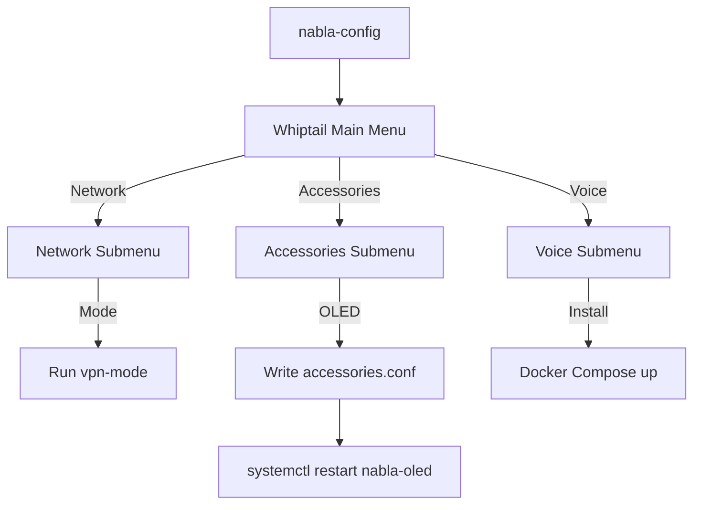

# Pi Config Menu — nabla-config

The `nabla-config` tool: a whiptail-based configuration menu for Raspberry Pi edge nodes.

---

## Installation

`nabla-config` is part of the `nabla-edge` package. Install via APT:

```bash
echo 'deb [trusted=yes] https://coco.nabla.net/apt/ stable main' | \
  sudo tee /etc/apt/sources.list.d/nabla.list
sudo apt update && sudo apt install nabla-edge
```

See [../packages-apt/](../packages-apt/) for full installation details.

---

## What is nabla-config?

`nabla-config` is an interactive terminal menu (using whiptail/dialog) that configures:

- **Network** — Nabla Net modes, uplink settings
- **Media** — USB/SD imaging for Nabla Pi OS
- **Accessories** — OLED, rotary encoder, large display flags
- **Camera** — Camera module settings
- **Voice Satellite** — Linux Voice Assistant for HA Assist

---

## Running nabla-config

```bash
# Interactive mode (default)
sudo nabla-config

# Show help
nabla-config --help

# Direct submenu access
sudo nabla-config network
sudo nabla-config accessories
sudo nabla-config voice
```

---

## Menu Tree

```
nabla-config (Main Menu)
├── Network
│   ├── Status            → Show current network status
│   ├── CABLE             → eth LAN + Tailscale
│   ├── AP                → SSID Nabla Net
│   ├── CABLE-AP          → eth + wlan1 AP
│   └── OFF               → Disable networking
│
├── Media (USB/SD)
│   ├── Nabla Pi OS full  → Write desktop image to USB/SD
│   ├── Nabla Pi OS lite  → Write lite image to USB/SD
│   ├── OTP enabler       → Pi 3B USB boot enabler
│   ├── List disks        → Show available drives
│   └── Download image    → Cache base image
│
├── Accessories
│   ├── Small I2C OLED    → Enable/disable
│   ├── Rotary encoder    → Enable/disable
│   ├── Large SPI display → Enable/disable
│   ├── Apply OLED now    → Enable OLED service
│   └── View profile      → Show accessories.conf
│
├── Camera
│   └── go2rtc            → Camera helper
│
└── Voice Satellite
    ├── Install / update     → Install LVA via Docker
    ├── ─ Configuration ─
    │   ├── Satellite name   → Name for HA entity
    │   └── ESPHome port     → Default 6053
    ├── ─ Trigger Mode ─
    │   ├── Mode             → button (default) / wake (continuous)
    │   ├── Wake word        → Select built-in wake word
    │   └── Wake word (custom) → Coming soon (Oye Veronica)
    ├── ─ Control ─
    │   ├── Start / Stop     → Control LVA container
    │   ├── View status      → Show LVA status
    │   └── HA Instructions  → ESPHome + dashboard button setup
```

---

## Configuration Files

### /etc/nabla-net/accessories.conf

Accessory flags file — controls which hardware is enabled:

```ini
# Accessories configuration
# Edit via nabla-config or manually

display_oled=1          # 1=enabled, 0=disabled
rotary=1                # Rotary encoder enabled
display_large=0         # Large SPI display (disabled by default)
```

### /etc/nabla-edge/voice.conf

Voice satellite configuration:

```ini
# Voice configuration (Linux Voice Assistant)

MODE=button             # button | wake
SATELLITE_NAME=demo     # HA entity name
PORT=6053               # ESPHome port
WAKE_WORD=hey_jarvis    # Wake word
```

---

## How nabla-config Works



1. User selects menu option via whiptail
2. Script validates input
3. Writes to appropriate config file
4. Restarts relevant service or container

---

## USB Hotplug Dialog

When a USB drive is inserted, nabla-config can trigger a dialog:

| Option | Action |
|--------|--------|
| **Write OS** | Launch nabla-image to write to the drive |
| **OTP Enable** | Write OTP bit for USB boot (Pi 3B only) |
| **Open Files** | Mount and browse the drive |
| **Nothing** | Ignore the drive |

---

## Command Line Reference

```
nabla-config [OPTIONS]

OPTIONS:
  --help, -h          Show this help message
  network             Jump to network submenu
  media               Jump to media submenu
  accessories         Jump to accessories submenu
  voice               Jump to voice submenu
  oled                Enable OLED directly
```

---

## OLED Menu Mirror

The menu structure can also render on a small I2C OLED display (SSD1306 128×64) navigated via rotary encoder. This allows headless configuration without SSH.

See **[OLED-MENU-DESIGN.md](OLED-MENU-DESIGN.md)** for the full design document.

### Quick Start

```bash
# On a Pi with SSD1306 OLED + EC11 encoder:
cd nablaedge/scripts
sudo ./nabla-oled-enable --with-rotary
```

### Key Files

| File | Purpose |
|------|---------|
| `scripts/menu_tree.yaml` | Single source of truth for menu structure |
| `scripts/nabla-oled-menu.py` | Python OLED renderer (production) |
| `scripts/nabla-oled-enable` | Installation/enable script |
| `scripts/systemd/nabla-oled-menu.service` | Systemd service unit |
| `docs/pi-config-menu/OLED-MENU-DESIGN.md` | Architecture + pinout |

### OLED Modes

| Mode | Description |
|------|-------------|
| **Reloj** | Clock/idle screen: ∇ logo + "nabla.net" + HH:MM |
| **Root Menu** | App selector: Reloj / Config |
| **Config** | nabla-config menu tree navigation |

### Encoder Controls

- **Rotate** → Navigate up/down in menus
- **Press** → Select item / enter submenu
- **60s idle** → Returns to Reloj (clock)

### Contributor Checklist

When editing `nabla-config` menus:

- [ ] Update `scripts/menu_tree.yaml` with matching changes
- [ ] Verify new actions have handler mappings in `nabla-oled-menu.py`
- [ ] Test both whiptail and OLED rendering if hardware available

---

## Related

- [../accessories/](../accessories/) — Hardware flags detail
- [../network-modes/](../network-modes/) — Network mode concepts
- [../voice-satellite/](../voice-satellite/) — Voice satellite setup (LVA)
- [OLED-MENU-DESIGN.md](OLED-MENU-DESIGN.md) — OLED menu architecture
