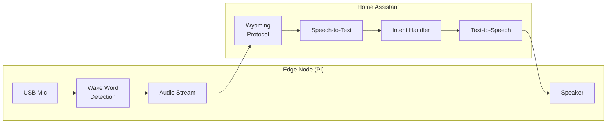
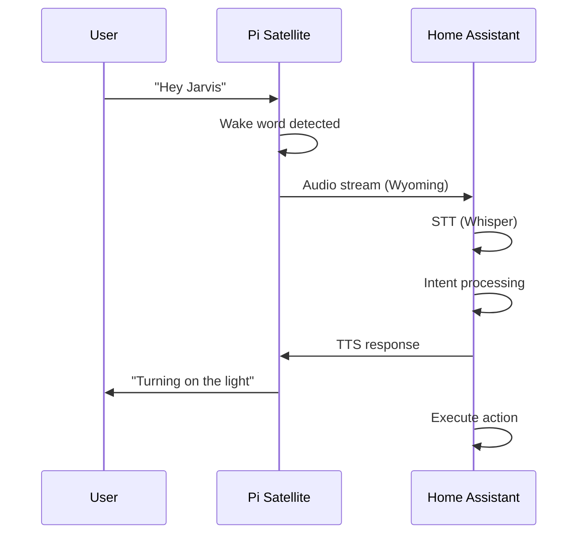

# Voice Satellite

Home Assistant Assist voice satellite for NablaEdge nodes.

---

## Overview

A voice satellite turns a Pi into a Home Assistant Assist endpoint:



**Components:**
- **Wake word**: Local detection (openWakeWord)
- **STT**: Speech-to-text (Whisper via HA)
- **Intent**: HA Assist conversation
- **TTS**: Text-to-speech response

---

## Hardware

### Required

| Component | Notes |
|-----------|-------|
| USB Microphone | Any USB mic, ReSpeaker recommended |
| Speaker | 3.5mm or USB audio |

### Optional

| Component | Notes |
|-----------|-------|
| LED ring | Visual feedback (ReSpeaker has built-in) |
| Button | Manual wake trigger |

---

## Software Stack

```
┌─────────────────────────────────────┐
│ wyoming-satellite                   │  ← Wyoming protocol client
├─────────────────────────────────────┤
│ openWakeWord                        │  ← Local wake word
├─────────────────────────────────────┤
│ PulseAudio / ALSA                   │  ← Audio routing
├─────────────────────────────────────┤
│ Linux (Pi OS)                       │
└─────────────────────────────────────┘
```

---

## Configuration

### Via nabla-config

```bash
sudo nabla-config --voice
# → Enable → Enable voice satellite
# → WakeWord → Configure wake word
# → Test → Test microphone
```

### Manual Setup

1. **Install wyoming-satellite**:
   ```bash
   pip install wyoming-satellite
   ```

2. **Configure**:
   ```yaml
   # /etc/wyoming-satellite/config.yaml
   name: "Edge Satellite"
   wake_word:
     provider: openWakeWord
     model: hey_jarvis
   audio:
     input_device: plughw:1,0
     output_device: plughw:0,0
   ```

3. **Enable service**:
   ```bash
   sudo systemctl enable wyoming-satellite
   sudo systemctl start wyoming-satellite
   ```

---

## Camera (Separate)

Camera streaming is **separate** from voice:

| Function | Component |
|----------|-----------|
| Voice | wyoming-satellite |
| Camera | go2rtc |

Both can run on the same Pi but are independent.

### go2rtc Basics

```yaml
# /etc/go2rtc.yaml
streams:
  camera1:
    - ffmpeg:device=/dev/video0
```

See camera documentation (separate) for streaming setup.

---

## Interaction Flow



---

## Troubleshooting

### Microphone Not Detected

```bash
# List audio devices
arecord -l

# Test recording
arecord -d 3 -f cd test.wav
aplay test.wav
```

### Wake Word Not Triggering

1. Check microphone sensitivity
2. Verify wake word model installed
3. Test in quiet environment
4. Check logs: `journalctl -u wyoming-satellite`

### No Audio Response

1. Check speaker connection
2. Verify audio output device in config
3. Test: `speaker-test -t wav`

---

## Status

🚧 **Documentation in progress**

Detailed setup guide requires sanitization of:
- HA instance URLs
- Device-specific audio paths
- Network configuration

See [../manuals/](../manuals/) for private PDF reference.

---

## Related

- [../pi-config-menu/](../pi-config-menu/) — Voice menu
- [../accessories/](../accessories/) — Hardware setup
- Home Assistant Assist documentation (external)
