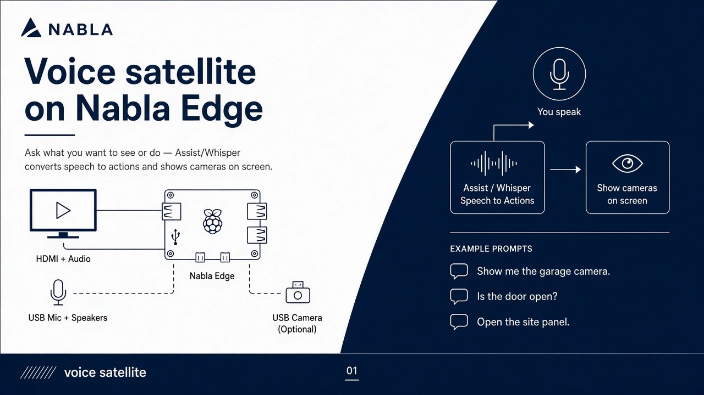

# Voice Satellite

A Nabla Edge Pi can become a **wall-mounted conversation point**: mic + speakers talking to Home Assistant Assist.



---

## Linux Voice Assistant (LVA)

We use **Linux Voice Assistant** from OHF-Voice — the official successor to Wyoming Satellite. LVA uses the ESPHome protocol and provides full Assist Satellite features.

> **Do NOT use Wyoming Satellite.** It is deprecated and lacks `start_conversation` support (`supported_features: 1` vs LVA's `supported_features: 3`). All new installations should use LVA.

| Feature | LVA | Wyoming Satellite (deprecated) |
|---------|-----|--------------------------------|
| Protocol | ESPHome (:6053) | Wyoming (:10700) |
| `start_conversation` | **Yes** | No |
| `announce` | Yes | Yes |
| Wake word | Built-in (microWakeWord) | Separate container |
| `supported_features` | **3** | 1 |
| Status | **Active** (OHF-Voice) | **Deprecated** |

---

## Deployment Paths

### Raspberry Pi (Wall-mounted)

**Primary trigger: Button / HA start_conversation**

Wall-mounted Pis are triggered remotely — users don't walk to the device. Use HA dashboard buttons or GPIO physical buttons.

- **Mode:** `button` (default)
- **Trigger:** `assist_satellite.start_conversation` from HA Companion app or dashboard
- **Wake word:** Disabled by default (saves CPU)
- **GPIO:** Optional physical button for local trigger

### Desktop / Mac / Linux Workstation

**Primary trigger: Wake word + optional button**

Desktop hosts can run continuous wake word detection.

- **Mode:** `wake`
- **Wake word:** `ok_nabu` (built-in), custom models available
- **Custom wake word:** "Oye Veronica" v2 ready — see [custom-wake-words/](custom-wake-words/)
- **Note:** HA `start_conversation` also works as a fallback

---

## Primary Trigger: Button / Remote Start

Wall-mounted Pi: users trigger from their phone, not by walking to the device.

```
Phone / HA Companion
        │
        │  tap "Listen" button
        ▼
┌─────────────────────────────────────────────────────────────────┐
│  Home Assistant                                                  │
│    assist_satellite.start_conversation                          │
│    target: assist_satellite.<name>_satellite_assist             │
└─────────────────────────────────────────────────────────────────┘
        │
        │  ESPHome protocol
        ▼
┌─────────────────────────────────────────────────────────────────┐
│  Nabla Edge Pi (wall-mounted)                                    │
│    Linux Voice Assistant :6053                                   │
│    [Wake word optional]                                          │
└─────────────────────────────────────────────────────────────────┘
        │
        │  Audio pipeline
        ▼
┌─────────────────────────────────────────────────────────────────┐
│  Home Assistant                                                  │
│    Whisper (STT) → Assist Pipeline → Piper (TTS)                │
└─────────────────────────────────────────────────────────────────┘
```

---

## Installation

### Via nabla-config (Recommended)

```bash
sudo nabla-config
# → Voice Satellite → Install / update LVA
```

### Manual Installation

```bash
# Requires Docker
curl -fsSL https://get.docker.com | sh
sudo usermod -aG docker $USER

# Install LVA
sudo /opt/nabla-edge/voice/install-lva.sh --name demo --wake hey_jarvis
```

The installer:
1. Downloads Docker Compose files from OHF-Voice/linux-voice-assistant
2. Creates `/opt/nabla-edge/voice/lva/` with configuration
3. Starts the LVA container
4. Writes config to `/etc/nabla-edge/voice.conf`

---

## Home Assistant Setup

### Step 1: Add via ESPHome Integration

1. **Settings → Devices & Services → Add Integration**
2. Search **ESPHome**
3. **Host:** `<Pi-IP-or-hostname>` (e.g., `192.0.2.10` or Tailscale IP)
4. **Port:** `6053`

The satellite appears as `assist_satellite.<name>_satellite_assist` with `supported_features: 3`.

### Step 2: Dashboard Listen Button

Add a button to trigger `start_conversation`:

```yaml
type: button
name: Listen
icon: mdi:microphone
tap_action:
  action: call-service
  service: assist_satellite.start_conversation
  target:
    entity_id: assist_satellite.demo_satellite_assist
  data:
    start_message: ""
```

With optional greeting:

```yaml
data:
  start_message: "Yes?"
```

### Step 3: Configure Assist Pipeline

1. **Settings → Voice assistants**
2. Create or edit a pipeline
3. Set **Speech-to-text** (Whisper), **Text-to-speech** (Piper)
4. Assign the pipeline to the satellite via the select entity

---

## Configuration

**Config file:** `/etc/nabla-edge/voice.conf`

```bash
# Mode: button (start_conversation) or wake (continuous wake word)
MODE=button

# Satellite name (appears as assist_satellite.<name>_satellite_assist)
SATELLITE_NAME=demo

# ESPHome port
PORT=6053

# Wake word (when MODE=wake)
# Available: hey_jarvis, ok_nabu, alexa, hey_mycroft
WAKE_WORD=hey_jarvis

# Optional GPIO button for physical trigger
GPIO_PIN=17
```

---

## Managing LVA

```bash
# View logs
cd /opt/nabla-edge/voice/lva
docker compose logs -f

# Restart
docker compose restart

# Stop
docker compose down

# Start
docker compose up -d

# Update to latest
docker compose pull
docker compose up -d
```

---

## Trigger Modes

### Button Mode (Default for Pi)

Primary trigger is HA `start_conversation` called from phone dashboard or GPIO button. Wake word disabled to save CPU.

**Recommended for:**
- Wall-mounted Pi satellites
- Battery-powered / low-power deployments
- Noisy environments

### Wake Mode (Desktop / Optional)

Continuous wake word detection using microWakeWord. Uses more CPU but enables hands-free activation.

**Available wake words:** `hey_jarvis`, `ok_nabu`, `alexa`, `hey_mycroft`

**Custom wake word:**
- "Oye Veronica" — v2 ready (cutoff 0.88)
- Model files (`.tflite` + `.json`) deploy to `/app/wakewords/custom/`
- See [custom-wake-words/](custom-wake-words/) for training and deployment

**Recommended for:**
- Desktop workstations with always-on power
- Hands-free environments
- Development/testing

---

## GPIO Button Trigger

For physical button trigger on Raspberry Pi, connect a momentary button between GPIO pin and GND.

### Wiring

```
GPIO 17 ─────┐
             │
           [ ○ ]  Momentary button
             │
GND ─────────┘
```

### Configuration

In `/etc/nabla-edge/voice.conf`:

```bash
MODE=button
GPIO_PIN=17
```

### HA Automation (Alternative)

Instead of local GPIO handling, you can use an HA automation to trigger `start_conversation` when a GPIO binary sensor activates:

```yaml
automation:
  - alias: "Voice button pressed"
    trigger:
      - platform: state
        entity_id: binary_sensor.example_voice_button
        to: "on"
    action:
      - service: assist_satellite.start_conversation
        target:
          entity_id: assist_satellite.demo_satellite_assist
```

### GPIO Button Service (Optional)

For local GPIO handling without HA, a systemd service can watch the GPIO pin and trigger LVA directly. This is planned for a future release.

---

## Troubleshooting

### LVA not connecting to HA

```bash
# Check LVA is running
docker ps | grep linux-voice-assistant

# Check port is listening
ss -tlnp | grep 6053

# View LVA logs
cd /opt/nabla-edge/voice/lva
docker compose logs -f
```

### No audio

```bash
# List audio devices
arecord -L
aplay -L

# Test mic
arecord -d 5 -r 16000 -c 1 -f S16_LE test.wav
aplay test.wav

# Check PipeWire/PulseAudio
pactl info
```

### start_conversation not working

Verify the entity has `supported_features: 3`:

```yaml
# In HA Developer Tools → States
# Search: assist_satellite.demo_satellite_assist
# Check: supported_features = 3
```

---

## Hardware Recommendations

### USB Audio

- **Jabra Speak 510** — Good mic, speaker, mute button
- **Generic USB sound card** + mic + powered speaker
- **ReSpeaker USB Array** — 4-mic array for far-field

### Audio Server

LVA requires PipeWire or PulseAudio. On Raspberry Pi OS:

```bash
# PipeWire (recommended)
sudo apt install pipewire pipewire-pulse wireplumber

# Enable for headless operation
loginctl enable-linger $USER
```

---

## Files

| Path | Description |
|------|-------------|
| `/etc/nabla-edge/voice.conf` | Configuration |
| `/opt/nabla-edge/voice/lva/` | Docker Compose files |
| `/opt/nabla-edge/voice/lva/.env` | LVA environment variables |
| `/app/wakewords/custom/` | Custom wake word models (.tflite + .json) |

---

## See Also

- [custom-wake-words/](custom-wake-words/) — Custom wake word training and deployment
- [`../../voice/`](../../voice/) — Voice module scripts
- [`../pi-config-menu/`](../pi-config-menu/) — nabla-config usage
- [OHF-Voice/linux-voice-assistant](https://github.com/OHF-Voice/linux-voice-assistant)
- [Home Assistant Assist](https://www.home-assistant.io/voice_control/)
